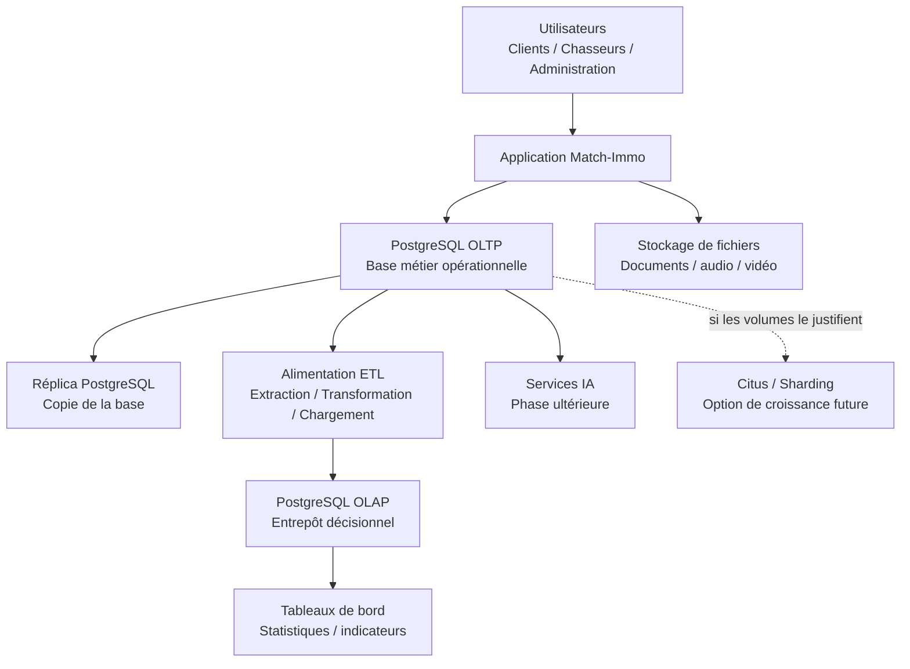

# Dossier d'architecture de croissance — Match-Immo

## Phase 3 — Absorber la croissance

## 1. Objectif du document

Ce document présente l'architecture envisagée pour permettre au système d'information Match-Immo d'accompagner la croissance future de l'entreprise.

L'objectif n'est pas de construire immédiatement une infrastructure complexe.

L'objectif est de répondre progressivement à la question suivante :

> Comment faire évoluer Match-Immo pour qu'il puisse traiter beaucoup plus de mandats, de biens immobiliers et de recherches sans perdre en performance, en disponibilité ou en maîtrise des données ?

L'architecture présentée dans ce dossier s'appuie sur l'analyse des **3V** réalisée précédemment :

- **Volume** : augmentation importante du nombre de données ;
- **Vélocité** : arrivée et modification fréquentes des annonces ;
- **Variété** : coexistence de données relationnelles, géographiques, textuelles et potentiellement multimédias.

La démarche retenue est progressive :

```text
Besoin métier
      ↓
Mesure de la croissance
      ↓
Architecture simple
      ↓
Optimisations mesurées
      ↓
Ajout de composants uniquement si nécessaire
```

L'objectif est donc d'éviter la complexité inutile.

---

# 2. Rappel du besoin de croissance

Le Starter Pack prévoit à terme :

- plusieurs milliers de mandats par semaine ;
- plusieurs centaines, voire plusieurs milliers de biens par recherche ;
- des sélections de biens renouvelées quotidiennement ou plusieurs fois par jour ;
- une expansion géographique vers plusieurs pays européens.

Pour disposer d'un scénario de travail reproductible, la note 3V retient comme hypothèse de dimensionnement :

```text
5 000 nouveaux mandats par semaine
jusqu'à 1 000 biens analysés par recherche
```

Cela peut représenter jusqu'à :

```text
5 000 000 de rapprochements recherche/bien par semaine
```

et théoriquement :

```text
260 000 000 de rapprochements recherche/bien par an
```

Ces chiffres ne représentent pas l'activité actuelle.

Ils constituent un scénario permettant de dimensionner et tester l'architecture.

---

# 3. Principe général retenu

L'architecture doit répondre à plusieurs besoins différents.

Il faut notamment :

1. faire fonctionner l'activité quotidienne ;
2. rechercher rapidement des biens ;
3. conserver l'historique ;
4. produire des statistiques ;
5. rester disponible en cas de panne ;
6. pouvoir absorber une forte augmentation des volumes ;
7. préparer les futures fonctionnalités d'intelligence artificielle.

Toutes ces fonctions ne nécessitent pas forcément le même composant technique.

L'architecture est donc organisée en plusieurs rôles.

---

# 4. Vue d'ensemble de l'architecture cible



Ce schéma représente une architecture cible progressive.

Tous les composants ne doivent pas obligatoirement être activés dès le démarrage.

---

# 5. L'application métier

L'application Match-Immo constitue le point d'entrée principal du système.

Elle permet notamment de gérer :

- les utilisateurs ;
- les clients ;
- les chasseurs ;
- les demandes ;
- les versions des demandes ;
- les mandats ;
- les biens ;
- les propositions ;
- les visites ;
- les commentaires ;
- les offres d'achat ;
- les ventes ;
- les paiements.

L'application ne doit pas connaître directement la manière physique dont les données sont stockées ou distribuées.

Elle dialogue avec PostgreSQL.

Cela permet de faire évoluer l'infrastructure de données sans devoir réécrire entièrement les règles métier.

---

# 6. PostgreSQL comme base principale

## 6.1 Qu'est-ce que PostgreSQL ?

**PostgreSQL** est un système de gestion de base de données relationnelle.

Une base de données relationnelle organise principalement les informations dans des tables reliées entre elles.

Exemple :

```text
CLIENT
   ↓
DEMANDE
   ↓
MANDAT
   ↓
PROPOSITION
   ↓
BIEN
```

PostgreSQL est déjà utilisé dans le modèle cible Match-Immo.

Il constitue donc la base principale de l'architecture.

---

## 6.2 Pourquoi conserver PostgreSQL ?

PostgreSQL répond bien aux besoins principaux du projet :

- transactions fiables ;
- relations entre les données ;
- contraintes d'intégrité ;
- indexation ;
- partitionnement ;
- réplication ;
- fonctions géographiques avec PostGIS ;
- possibilités d'extension ;
- compatibilité avec Citus pour une évolution distribuée.

Il n'est donc pas nécessaire de remplacer immédiatement PostgreSQL lorsque les volumes augmentent.

La première stratégie consiste à l'optimiser correctement.

---

# 7. OLTP — la base utilisée pour le métier quotidien

## 7.1 Définition

**OLTP** signifie :

> Online Transaction Processing.

Il s'agit de la base utilisée pour les opérations quotidiennes du métier.

Exemples :

```text
Créer un client
Créer une demande
Modifier les critères d'une recherche
Créer un mandat
Enregistrer une visite
Créer une offre d'achat
Enregistrer un paiement
```

Ces opérations sont généralement courtes et doivent être exécutées rapidement.

---

## 7.2 Rôle dans Match-Immo

La base PostgreSQL métier constitue l'OLTP de Match-Immo.

Elle reste la source principale des données opérationnelles.

L'objectif est de la maintenir :

- cohérente ;
- fiable ;
- rapide ;
- disponible.

Elle ne doit cependant pas être surchargée par de très grosses analyses statistiques.

---

# 8. Séparation OLTP / OLAP

## 8.1 Pourquoi séparer les deux usages ?

Une requête métier et une requête statistique n'ont pas le même objectif.

Exemple de requête OLTP :

```text
Afficher le mandat du client n°1254.
```

Cette requête porte généralement sur très peu de lignes.

Exemple de requête analytique :

```text
Calculer le taux de conversion de tous les chasseurs
par région et par trimestre sur cinq ans.
```

Cette seconde requête peut parcourir des millions de lignes.

Si toutes les grosses analyses sont exécutées directement sur la base métier, elles peuvent ralentir les utilisateurs.

On prévoit donc une séparation entre :

```text
OLTP
= fonctionnement quotidien

OLAP
= analyse et décisionnel
```

---

# 9. OLAP — l'entrepôt destiné aux statistiques

## 9.1 Définition

**OLAP** signifie :

> Online Analytical Processing.

Il s'agit d'une organisation de données adaptée à l'analyse.

L'OLAP servira notamment à produire :

- chiffre d'affaires ;
- nombre de mandats ;
- taux de réussite ;
- durée moyenne des recherches ;
- performance des chasseurs ;
- nombre de visites avant achat ;
- statistiques géographiques ;
- évolution dans le temps.

---

## 9.2 Principe d'alimentation

Les données nécessaires seront transférées de l'OLTP vers l'OLAP.

La chaîne générale sera :

```text
Base OLTP
   ↓
ETL
   ↓
Base OLAP
   ↓
Tableaux de bord
```

**ETL** signifie :

> Extract, Transform, Load.

En français :

```text
Extraire
↓
Transformer
↓
Charger
```

Exemple :

```text
PostgreSQL métier
      ↓
extraire les ventes
      ↓
calculer les délais et les indicateurs
      ↓
charger les résultats dans l'entrepôt OLAP
```

Le modèle OLAP et son alimentation seront détaillés dans une étape dédiée de la Phase 3.

---

# 10. Indexation

## 10.1 Définition simple

Un **index** fonctionne de manière comparable à l'index d'un livre.

Sans index, PostgreSQL peut devoir parcourir une grande partie d'une table pour retrouver certaines données.

Avec un index adapté, il peut accéder beaucoup plus rapidement aux lignes recherchées.

Exemple :

```text
Recherche :
secteur = Montpellier
prix <= 350 000 €
surface >= 60 m²
```

Si la table contient plusieurs millions de biens, un bon index peut réduire fortement le travail nécessaire.

---

## 10.2 Position dans l'architecture

L'indexation constitue la première méthode d'optimisation envisagée.

La règle retenue est :

> Un index doit répondre à un besoin réel et être confirmé par une mesure.

On ne créera donc pas des index sur toutes les colonnes.

Les performances seront mesurées avec :

```sql
EXPLAIN (ANALYZE, BUFFERS)
```

Cette commande PostgreSQL permet d'observer comment une requête est réellement exécutée.

Le benchmark d'indexation sera réalisé dans une étape dédiée.

---

# 11. Partitionnement

## 11.1 Définition simple

Le **partitionnement** consiste à découper une très grande table en plusieurs morceaux plus petits.

Exemple :

```text
PRESENTATION
│
├── données janvier 2026
├── données février 2026
├── données mars 2026
├── données avril 2026
└── ...
```

Pour une recherche portant uniquement sur mars, PostgreSQL peut éventuellement éviter de parcourir les données des autres mois.

---

## 11.2 Pourquoi ne pas tout partitionner ?

Le partitionnement ajoute également de la complexité.

Une petite table de quelques milliers de lignes n'a généralement aucun intérêt à être partitionnée.

La stratégie sera donc :

```text
petite table
→ pas de partitionnement inutile

très grande table
+ requêtes adaptées
→ étude du partitionnement
```

Le partitionnement sera testé séparément sur un volume significatif.

---

# 12. Réplication PostgreSQL

## 12.1 Définition

La **réplication** consiste à maintenir une ou plusieurs copies d'une base PostgreSQL.

Exemple :

```text
           PostgreSQL principal
                   |
                   |
            réplication
                   |
                   v
             PostgreSQL copie
```

La base principale est souvent appelée **primaire**.

La copie est généralement appelée **réplica**.

---

## 12.2 Pourquoi utiliser une réplication ?

La réplication peut répondre à deux besoins.

### Disponibilité

Si une instance PostgreSQL rencontre une panne, une autre instance peut éventuellement prendre le relais.

### Répartition de certaines lectures

Certaines requêtes de lecture peuvent être dirigées vers un réplica.

Cela permet de soulager le serveur principal dans certaines architectures.

---

## 12.3 Attention : réplication et sauvegarde sont différentes

La réplication n'est pas une sauvegarde.

Exemple :

Si une donnée est accidentellement supprimée sur le serveur principal, cette suppression peut également être reproduite sur le réplica.

Il faut donc distinguer :

```text
Réplication
= maintenir plusieurs copies actives

Sauvegarde
= permettre de revenir à une situation antérieure
```

Cette distinction sera reprise dans le PCA/PRA.

---

# 13. Haute disponibilité

La **haute disponibilité** consiste à concevoir le système pour réduire les interruptions de service.

Une architecture de haute disponibilité peut comporter :

```text
PostgreSQL primaire
+
un ou plusieurs réplicas
+
un mécanisme de bascule
```

Une **bascule**, ou **failover**, signifie qu'une autre instance prend le rôle principal lorsque le serveur principal devient indisponible.

La haute disponibilité sera étudiée et testée dans une étape dédiée.

---

# 14. Sharding

## 14.1 Définition

Le **sharding** consiste à découper horizontalement une très grande quantité de données et à la répartir entre plusieurs nœuds.

Un **nœud** désigne ici une instance ou un serveur participant au système.

Exemple simplifié :

```text
                    Données Match-Immo
                          |
             ---------------------------
             |                         |
          Nœud A                    Nœud B
          partie 1                  partie 2
```

Chaque partie est appelée un **shard**.

---

## 14.2 Différence avec le partitionnement

Les deux notions sont proches mais ne répondent pas exactement au même problème.

### Partitionnement

```text
Une base PostgreSQL
      |
      ├── partition 1
      ├── partition 2
      └── partition 3
```

Les morceaux restent généralement gérés dans le même système PostgreSQL.

### Sharding

```text
Plusieurs nœuds
      |
      ├── serveur A → shards
      ├── serveur B → shards
      └── serveur C → shards
```

La charge et les données peuvent être réparties physiquement entre plusieurs nœuds.

---

# 15. Citus comme option de croissance

## 15.1 Qu'est-ce que Citus ?

**Citus** est une extension de PostgreSQL permettant de distribuer certaines tables sur plusieurs nœuds PostgreSQL.

Une architecture Citus peut ressembler à :

```text
                  Application
                       |
                       v
              Coordinateur Citus
                 /           \
                /             \
               v               v
          Worker 1          Worker 2
          shards             shards
```

Le **coordinateur** reçoit la requête.

Les **workers** sont les nœuds qui stockent et traitent les shards.

---

## 15.2 Pourquoi Citus n'est pas activé immédiatement ?

L'analyse 3V montre une croissance potentiellement importante.

Mais cela ne prouve pas encore qu'un PostgreSQL correctement optimisé sera insuffisant.

Ajouter Citus trop tôt entraînerait :

- plus de composants ;
- plus de configuration ;
- plus de surveillance ;
- plus de contraintes sur le modèle de données ;
- plus de complexité pour les jointures et certaines transactions.

La décision retenue à ce stade est donc :

```text
Citus
→ technologie à étudier
→ POC à réaliser
→ option d'évolution
→ pas une obligation immédiate
```

**POC** signifie Proof of Concept.

Un POC est une petite expérimentation permettant de vérifier qu'une solution fonctionne techniquement avant d'envisager une utilisation réelle.

---

# 16. Architecture progressive retenue

L'évolution proposée est organisée en plusieurs niveaux.

## Niveau 1 — Architecture simple

```text
Application Match-Immo
        |
        v
PostgreSQL
```

Cette architecture reste pertinente tant que les performances sont suffisantes.

---

## Niveau 2 — Optimisation PostgreSQL

```text
Application
     |
     v
PostgreSQL
     |
     +-- indexation ciblée
     |
     +-- optimisation des requêtes
     |
     +-- partitionnement lorsque nécessaire
```

On cherche d'abord à utiliser correctement les capacités natives de PostgreSQL.

---

## Niveau 3 — Disponibilité et séparation analytique

```text
                       +--> réplica
                       |
Application --> PostgreSQL OLTP
                       |
                       +--> ETL --> OLAP --> tableaux de bord
```

Cette étape permet :

- de protéger davantage le fonctionnement métier ;
- de séparer les analyses statistiques du traitement quotidien.

---

## Niveau 4 — Distribution si nécessaire

```text
                       Citus
                        |
                 Coordinateur
                  /          \
                 /            \
            Worker 1       Worker 2
```

Cette architecture n'est étudiée que si les mesures montrent que la montée en charge verticale et les optimisations classiques deviennent insuffisantes.

---

# 17. Montée en charge verticale et horizontale

Deux grandes stratégies permettent d'augmenter la capacité d'un système.

## 17.1 Montée en charge verticale

La **montée en charge verticale** consiste à augmenter les ressources d'une seule machine.

Par exemple :

```text
plus de RAM
plus de processeurs
SSD plus rapide
```

Cette méthode est relativement simple mais possède une limite physique.

---

## 17.2 Montée en charge horizontale

La **montée en charge horizontale** consiste à utiliser plusieurs machines ou plusieurs instances.

Exemple :

```text
1 serveur
↓
2 serveurs
↓
4 serveurs
↓
plusieurs nœuds
```

La réplication et le sharding participent à cette logique.

Citus constitue une solution possible de montée en charge horizontale pour PostgreSQL.

---

# 18. Données multimédias

Le système Match-Immo peut à terme manipuler :

- photographies ;
- documents ;
- fichiers audio ;
- vidéos.

Stocker de très gros fichiers directement dans la base PostgreSQL n'est pas nécessairement la meilleure solution.

Une architecture peut utiliser un **stockage objet**.

Un stockage objet est un système spécialisé dans la conservation de fichiers.

Le principe serait :

```text
PostgreSQL
→ conserve les informations métier et la référence du fichier

Stockage objet
→ conserve le fichier lui-même
```

Exemple :

```text
COMMENTAIRE
id = 42
texte = "Cuisine à rénover"
audio_url = "/avis/audio-42.mp3"
```

Le fichier audio serait conservé dans le stockage spécialisé, tandis que PostgreSQL conserverait son emplacement.

Le choix précis d'une technologie de stockage n'est pas arrêté dans ce dossier.

---

# 19. Géolocalisation

L'immobilier dépend fortement de la localisation.

Le système doit notamment pouvoir exploiter :

- villes ;
- codes postaux ;
- secteurs ;
- coordonnées géographiques.

PostgreSQL peut être complété par **PostGIS**.

PostGIS est une extension de PostgreSQL spécialisée dans les données géographiques.

Elle permet par exemple de répondre à des questions comme :

```text
Quels biens se trouvent dans cette zone ?

Quels biens se trouvent à moins de 5 km d'un point ?

Quels biens appartiennent à ce secteur géographique ?
```

PostGIS constitue donc une extension cohérente pour les futurs besoins géographiques du projet.

---

# 20. Préparation de l'intelligence artificielle

La Phase 4 pourra introduire des traitements d'intelligence artificielle destinés notamment au rapprochement entre :

```text
critères d'une recherche
        ↕
caractéristiques d'un bien
```

L'architecture de Phase 3 doit donc éviter de bloquer cette évolution.

Cependant, aucune infrastructure IA complexe n'est imposée à ce stade.

Le principe retenu est :

```text
données métier propres
        ↓
historique exploitable
        ↓
architecture analytique
        ↓
future utilisation IA
```

Le choix détaillé du modèle d'IA et des éventuelles représentations vectorielles appartient à la Phase 4.

---

# 21. Sécurité et maîtrise des données

La croissance ne doit pas conduire à perdre la maîtrise des données.

L'architecture devra conserver plusieurs principes :

- séparation des responsabilités ;
- limitation des accès ;
- protection des données personnelles ;
- sauvegardes ;
- journalisation des opérations importantes ;
- chiffrement lorsque nécessaire ;
- contrôle des accès aux composants techniques.

L'OLAP ne doit pas devenir une copie incontrôlée de toutes les données personnelles de la base métier.

Les données analytiques devront être limitées aux informations réellement nécessaires.

Cette logique rejoint les principes RGPD étudiés précédemment.

---

# 22. Éco-conception

Une architecture plus complexe consomme davantage :

- de processeur ;
- de mémoire ;
- de stockage ;
- d'énergie ;
- de ressources d'administration.

Le projet retient donc une approche de **complexité progressive**.

Exemple :

```text
PostgreSQL fonctionne correctement
→ conserver PostgreSQL simple

Un index résout le problème
→ ne pas ajouter un cluster distribué

Une table devient réellement trop grande
→ étudier le partitionnement

Un seul serveur devient insuffisant
→ étudier une montée en charge horizontale
```

Cette stratégie permet d'éviter de déployer des ressources techniques qui n'apportent pas de bénéfice réel.

---

# 23. Comparaison générale des solutions étudiées

Cette comparaison reste volontairement générale.

La matrice de décision détaillée sera réalisée dans le prochain livrable.

| Solution | Problème principalement traité | Complexité | Position actuelle |
|---|---|---:|---|
| PostgreSQL simple | Fonctionnement métier | Faible | Retenu |
| Indexation | Rapidité des recherches | Faible | À tester et utiliser de manière ciblée |
| Partitionnement | Très grandes tables | Moyenne | À tester sur les tables pertinentes |
| Réplication | Disponibilité et certaines lectures | Moyenne | À étudier/tester |
| OLAP séparé | Analyses et statistiques | Moyenne | Retenu comme architecture cible |
| Citus / sharding | Distribution de très gros volumes | Élevée | Option de croissance à valider par POC |

Cette architecture ne considère donc pas toutes les technologies comme obligatoires.

Elle distingue :

```text
ce qui est nécessaire maintenant
et
ce qui constitue une capacité d'évolution
```

---

# 24. Architecture cible recommandée à ce stade

À ce stade de la Phase 3, l'architecture cible peut être représentée ainsi :

```text
                         UTILISATEURS
                              |
                              v
                    APPLICATION MATCH-IMMO
                              |
                              v
                     POSTGRESQL — OLTP
                     /       |       \
                    /        |        \
                   v         v         v
            INDEXATION   RÉPLICA     ETL
                |                       |
        PARTITIONNEMENT                 v
        si nécessaire              POSTGRESQL
                                      OLAP
                                       |
                                       v
                              TABLEAUX DE BORD


Évolution possible si les volumes dépassent les capacités
d'un PostgreSQL correctement optimisé :

                     POSTGRESQL / CITUS
                           |
                     COORDINATEUR
                      /         \
                     v           v
                 WORKER 1     WORKER 2
                  shards       shards
```

---

# 25. Décision d'architecture provisoire

La stratégie retenue à ce stade est :

```text
1. conserver PostgreSQL comme socle principal ;

2. séparer les traitements opérationnels OLTP
   des traitements analytiques OLAP ;

3. optimiser PostgreSQL par des index mesurés ;

4. étudier le partitionnement uniquement
   sur les tables dont la volumétrie le justifie ;

5. étudier la réplication pour la disponibilité ;

6. tester Citus par un POC ;

7. ne retenir le sharding en exploitation
   que si les mesures démontrent son utilité.
```

Cette décision est volontairement progressive.

Elle permet d'accompagner la croissance sans imposer immédiatement une infrastructure distribuée complexe.

---

# 26. Ce qui doit encore être démontré

Le présent dossier décrit l'architecture et les principes retenus.

Plusieurs éléments doivent maintenant être vérifiés expérimentalement.

Ils seront traités dans les prochaines étapes de la Phase 3 :

```text
1. Matrice de décision d'architecture

2. Modèle OLTP / OLAP et alimentation ETL

3. Benchmark d'indexation avec EXPLAIN ANALYZE

4. Benchmark de partitionnement

5. Test de réplication et de haute disponibilité

6. POC Citus / sharding

7. Risques, PCA et PRA
```

Les décisions finales seront ajustées en fonction des preuves obtenues.

---

# 27. Conclusion

L'analyse 3V montre que Match-Immo doit pouvoir évoluer vers des volumes bien supérieurs aux données actuellement disponibles.

Cependant, la croissance ne justifie pas automatiquement l'utilisation immédiate d'une architecture distribuée.

La stratégie retenue privilégie une évolution progressive :

```text
PostgreSQL
      ↓
indexation et optimisation
      ↓
partitionnement lorsque nécessaire
      ↓
réplication et séparation OLTP / OLAP
      ↓
Citus / sharding uniquement si les métriques le justifient
```

Cette architecture présente plusieurs avantages :

- elle reste compréhensible ;
- elle limite la complexité inutile ;
- elle permet de mesurer chaque évolution ;
- elle conserve PostgreSQL comme socle cohérent ;
- elle prépare les besoins décisionnels ;
- elle permet une évolution vers une architecture distribuée ;
- elle prépare les futures fonctionnalités d'intelligence artificielle.

Le principe directeur de la Phase 3 reste donc :

> **mesurer avant de complexifier.**

Les prochaines expérimentations permettront de transformer cette architecture théorique en décisions techniques prouvées et défendables.