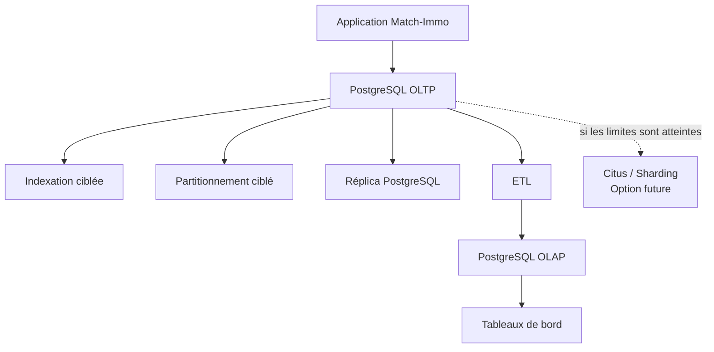

# Matrice de décision d'architecture — Match-Immo

## Phase 3 — Absorber la croissance

## 1. Objectif

Cette matrice de décision a pour objectif de comparer plusieurs solutions techniques pouvant accompagner la croissance de Match-Immo.

Une **matrice de décision** est un tableau permettant de comparer plusieurs solutions à partir de critères identiques.

Elle permet de répondre à une question simple :

> Quelle solution apporte le meilleur compromis entre performance, capacité de croissance, simplicité, disponibilité, sécurité, coût et impact environnemental ?

L'objectif n'est pas de choisir la technologie la plus complexe.

La démarche retenue est :

```text
Besoin
↓
Critères
↓
Comparaison
↓
Score
↓
Décision justifiée
```

Cette matrice complète :

- la note de dimensionnement 3V ;
- le dossier d'architecture de croissance.

Les choix techniques seront ensuite confirmés ou corrigés par les benchmarks et les POC de la Phase 3.

---

# 2. Solutions étudiées

Les principales solutions étudiées sont :

1. PostgreSQL simple et correctement optimisé ;
2. PostgreSQL avec partitionnement ciblé ;
3. PostgreSQL avec réplication ;
4. séparation OLTP / OLAP ;
5. PostgreSQL distribué avec Citus.

Ces solutions ne sont pas forcément concurrentes.

Certaines peuvent être utilisées ensemble.

Par exemple :

```text
PostgreSQL
+
indexation
+
partitionnement ciblé
+
réplication
+
OLAP séparé
```

peut constituer une architecture cohérente sans nécessiter immédiatement Citus.

---

# 3. Définition des critères

Pour comparer les solutions, plusieurs critères sont utilisés.

## 3.1 Performance

La **performance** représente la capacité du système à répondre rapidement aux requêtes.

Exemple :

```text
Rechercher des biens
Afficher un mandat
Calculer une statistique
```

Une bonne performance signifie que le système répond suffisamment rapidement pour les utilisateurs.

---

## 3.2 Scalabilité

La **scalabilité**, ou capacité de montée en charge, représente la capacité d'un système à supporter davantage :

- d'utilisateurs ;
- de données ;
- de requêtes ;
- de traitements.

Exemple :

```text
10 000 biens
↓
1 000 000 biens
↓
10 000 000 biens
```

Une architecture scalable doit pouvoir évoluer sans être entièrement reconstruite.

---

## 3.3 Disponibilité

La **disponibilité** représente la capacité du système à rester accessible malgré une panne.

Exemple :

```text
Serveur principal en panne
↓
un autre serveur peut prendre le relais
```

---

## 3.4 Complexité technique

La complexité représente la difficulté :

- d'installation ;
- de configuration ;
- de maintenance ;
- de surveillance ;
- de dépannage.

Une technologie très performante mais extrêmement complexe n'est pas forcément le meilleur choix.

---

## 3.5 Sécurité et maîtrise des données

Ce critère représente la capacité à :

- contrôler les accès ;
- protéger les données personnelles ;
- limiter les copies inutiles ;
- garantir la cohérence ;
- maintenir la traçabilité.

---

## 3.6 Coût

Le coût ne correspond pas uniquement au prix d'une licence.

Il comprend également :

- nombre de serveurs ;
- stockage ;
- mémoire ;
- processeur ;
- exploitation ;
- maintenance ;
- temps humain.

Les technologies étudiées sont principalement open source, mais leur exploitation possède malgré tout un coût.

---

## 3.7 Éco-conception

L'éco-conception consiste à éviter d'utiliser davantage de ressources que nécessaire.

Exemple :

```text
Un index résout le problème
→ ne pas déployer 5 serveurs supplémentaires
```

Ce critère prend donc en compte :

- ressources matérielles ;
- stockage ;
- consommation énergétique ;
- complexité inutile.

---

## 3.8 Compatibilité avec le projet

Ce critère représente la facilité d'intégration avec l'existant Match-Immo.

Le projet utilise déjà PostgreSQL.

Une solution qui reste compatible avec PostgreSQL est donc plus simple à intégrer qu'un remplacement complet du système de base de données.

---

# 4. Pondération des critères

Tous les critères n'ont pas la même importance.

Une **pondération** consiste à donner davantage de poids aux critères les plus importants.

La notation utilisée est :

```text
1 = faible importance
2 = importance moyenne
3 = forte importance
```

Les pondérations retenues sont :

| Critère | Poids | Pourquoi ? |
|---|---:|---|
| Performance | 3 | Match-Immo doit rechercher et traiter beaucoup de biens rapidement |
| Scalabilité | 3 | Le Starter Pack prévoit une forte croissance |
| Disponibilité | 2 | Le service doit pouvoir continuer à fonctionner en cas d'incident |
| Complexité | 2 | Une architecture trop complexe augmente les risques et les coûts |
| Sécurité | 3 | Match-Immo manipule des données personnelles et métier sensibles |
| Coût | 2 | L'architecture doit rester économiquement raisonnable |
| Éco-conception | 2 | Il faut éviter les ressources inutiles |
| Compatibilité projet | 3 | Le système cible repose déjà sur PostgreSQL |

---

# 5. Méthode de notation

Chaque solution reçoit une note de :

```text
1 = faible
2 = moyen
3 = bon
4 = très bon
5 = excellent
```

Pour le critère **complexité**, une bonne note signifie que la solution reste relativement simple à exploiter.

Ainsi :

```text
5 = simple
1 = très complexe
```

Le score pondéré est calculé ainsi :

```text
note × poids
```

Exemple :

```text
Performance = 4
Poids = 3

4 × 3 = 12 points
```

---

# 6. Matrice de décision globale

| Critère | Poids | PostgreSQL optimisé | Partitionnement | Réplication | OLTP / OLAP | Citus |
|---|---:|---:|---:|---:|---:|---:|
| Performance | 3 | 4 | 4 | 3 | 4 | 5 |
| Scalabilité | 3 | 3 | 4 | 3 | 4 | 5 |
| Disponibilité | 2 | 2 | 2 | 5 | 3 | 4 |
| Simplicité d'exploitation | 2 | 5 | 4 | 3 | 3 | 2 |
| Sécurité / maîtrise | 3 | 5 | 5 | 4 | 4 | 4 |
| Coût | 2 | 5 | 5 | 3 | 4 | 2 |
| Éco-conception | 2 | 5 | 4 | 3 | 4 | 2 |
| Compatibilité Match-Immo | 3 | 5 | 5 | 5 | 5 | 4 |

---

# 7. Calcul des scores

## 7.1 PostgreSQL optimisé

Calcul :

```text
Performance       : 4 × 3 = 12
Scalabilité       : 3 × 3 = 9
Disponibilité     : 2 × 2 = 4
Simplicité        : 5 × 2 = 10
Sécurité          : 5 × 3 = 15
Coût              : 5 × 2 = 10
Éco-conception    : 5 × 2 = 10
Compatibilité     : 5 × 3 = 15
```

Score :

```text
85 points
```

---

## 7.2 PostgreSQL avec partitionnement

```text
Performance       : 4 × 3 = 12
Scalabilité       : 4 × 3 = 12
Disponibilité     : 2 × 2 = 4
Simplicité        : 4 × 2 = 8
Sécurité          : 5 × 3 = 15
Coût              : 5 × 2 = 10
Éco-conception    : 4 × 2 = 8
Compatibilité     : 5 × 3 = 15
```

Score :

```text
84 points
```

---

## 7.3 PostgreSQL avec réplication

```text
Performance       : 3 × 3 = 9
Scalabilité       : 3 × 3 = 9
Disponibilité     : 5 × 2 = 10
Simplicité        : 3 × 2 = 6
Sécurité          : 4 × 3 = 12
Coût              : 3 × 2 = 6
Éco-conception    : 3 × 2 = 6
Compatibilité     : 5 × 3 = 15
```

Score :

```text
73 points
```

---

## 7.4 Séparation OLTP / OLAP

```text
Performance       : 4 × 3 = 12
Scalabilité       : 4 × 3 = 12
Disponibilité     : 3 × 2 = 6
Simplicité        : 3 × 2 = 6
Sécurité          : 4 × 3 = 12
Coût              : 4 × 2 = 8
Éco-conception    : 4 × 2 = 8
Compatibilité     : 5 × 3 = 15
```

Score :

```text
79 points
```

---

## 7.5 Citus

```text
Performance       : 5 × 3 = 15
Scalabilité       : 5 × 3 = 15
Disponibilité     : 4 × 2 = 8
Simplicité        : 2 × 2 = 4
Sécurité          : 4 × 3 = 12
Coût              : 2 × 2 = 4
Éco-conception    : 2 × 2 = 4
Compatibilité     : 4 × 3 = 12
```

Score :

```text
74 points
```

---

# 8. Classement obtenu

| Rang | Solution | Score |
|---:|---|---:|
| 1 | PostgreSQL optimisé | 85 |
| 2 | Partitionnement ciblé | 84 |
| 3 | Séparation OLTP / OLAP | 79 |
| 4 | Citus | 74 |
| 5 | Réplication | 73 |

Ce classement doit être interprété avec prudence.

Il ne signifie pas :

```text
Réplication = mauvaise solution
```

La réplication répond simplement à un besoin différent.

Son objectif principal est la disponibilité, et non l'accélération directe des écritures.

De la même manière, Citus obtient un score légèrement inférieur car sa complexité et son coût sont plus importants.

Cela ne signifie pas qu'il est techniquement moins performant.

---

# 9. Analyse par solution

## 9.1 PostgreSQL optimisé

### Avantages

- déjà utilisé par Match-Immo ;
- très bonne compatibilité avec le modèle cible ;
- administration maîtrisable ;
- nombreuses possibilités d'optimisation ;
- faible coût supplémentaire ;
- bonne sobriété technique.

### Limites

Une seule instance possède une limite matérielle.

À très forte croissance, augmenter uniquement la RAM ou le processeur ne suffira plus forcément.

### Décision

```text
RETENU
```

PostgreSQL reste le socle principal.

Il doit être correctement optimisé avant d'ajouter des technologies distribuées.

---

# 10. Indexation

L'indexation n'est pas considérée comme une architecture indépendante.

Elle constitue une optimisation fondamentale de PostgreSQL.

La stratégie retenue est :

```text
requête métier
↓
mesure sans index
↓
création d'un index adapté
↓
nouvelle mesure
↓
conservation seulement si gain démontré
```

### Décision

```text
RETENUE
```

Mais les index devront être validés par `EXPLAIN ANALYZE`.

---

# 11. Partitionnement

Le partitionnement obtient un score élevé car il permet d'améliorer la gestion de très grandes tables sans changer complètement d'architecture.

### Avantages

- intégré directement à PostgreSQL ;
- facilite la gestion des gros volumes ;
- peut réduire les données parcourues ;
- facilite certaines opérations d'archivage.

### Limites

- inutile sur les petites tables ;
- contraintes supplémentaires sur le modèle ;
- toutes les requêtes ne bénéficient pas du partitionnement.

### Décision

```text
RETENU DE MANIÈRE CIBLÉE
```

Il sera utilisé uniquement lorsque les volumes et les requêtes le justifient.

---

# 12. Réplication

La réplication n'obtient pas le meilleur score global, car son objectif n'est pas de résoudre tous les problèmes de performance.

Elle est particulièrement importante pour la disponibilité.

### Avantages

- permet de disposer d'une copie active de PostgreSQL ;
- possibilité de bascule en cas de panne ;
- possibilité de délester certaines lectures.

### Limites

- nécessite plusieurs instances ;
- consomme davantage de ressources ;
- ajoute de la complexité ;
- ne remplace pas les sauvegardes.

### Décision

```text
RETENUE POUR LA HAUTE DISPONIBILITÉ
```

Elle devra être justifiée par un POC ou une preuve technique dédiée.

---

# 13. Séparation OLTP / OLAP

Cette solution répond principalement au besoin de séparer :

```text
activité métier
et
analyse statistique
```

### Avantages

- évite que les grosses analyses ralentissent la base opérationnelle ;
- facilite les tableaux de bord ;
- permet un modèle de données adapté à l'analyse ;
- prépare les futures analyses avancées.

### Limites

- seconde base à administrer ;
- nécessité d'une alimentation ETL ;
- duplication contrôlée de certaines données.

### Décision

```text
RETENUE
```

Le modèle OLAP sera construit dans une étape dédiée.

---

# 14. Citus

Citus présente les meilleures capacités de montée en charge horizontale parmi les solutions étudiées.

Cependant, la scalabilité maximale ne constitue pas le seul critère.

### Avantages

- distribution des données ;
- plusieurs workers ;
- traitement parallèle ;
- capacité à dépasser les limites d'une seule machine ;
- reste dans l'écosystème PostgreSQL.

### Limites

- architecture plus complexe ;
- choix de clé de distribution important ;
- certaines jointures peuvent être plus coûteuses ;
- davantage de nœuds à surveiller ;
- coût matériel et énergétique supérieur ;
- inutile si PostgreSQL simple répond déjà au besoin.

### Décision

```text
POC À RÉALISER
OPTION DE CROISSANCE
NON ACTIVÉ IMMÉDIATEMENT
```

Le POC servira à vérifier son fonctionnement et ses limites avant une décision définitive.

---

# 15. Décision d'architecture résultante

La matrice ne conduit pas à choisir une seule technologie.

Elle conduit à définir une architecture progressive.

## Niveau actuel

```text
PostgreSQL
+
indexation ciblée
```

## Croissance des tables

```text
PostgreSQL
+
indexation
+
partitionnement ciblé
```

## Besoin de disponibilité

```text
PostgreSQL primaire
+
réplica
```

## Besoin analytique

```text
PostgreSQL OLTP
+
ETL
+
PostgreSQL OLAP
```

## Très forte croissance

```text
Citus
+
sharding
```

uniquement si les mesures démontrent que les solutions précédentes deviennent insuffisantes.

---

# 16. Architecture recommandée



---

# 17. Principe de complexité progressive

La décision finale repose sur un principe simple :

> Utiliser la solution la plus simple capable de répondre correctement au besoin.

Exemple :

```text
Un index suffit
→ utiliser un index

Un index ne suffit plus
→ étudier le partitionnement

Une panne doit être absorbée
→ ajouter la réplication

Les analyses ralentissent l'OLTP
→ séparer OLTP et OLAP

Une machine ne suffit réellement plus
→ étudier le sharding
```

Cette démarche permet de limiter :

- la complexité ;
- les coûts ;
- la consommation de ressources ;
- les risques d'exploitation.

---

# 18. Lien avec l'éco-conception

Une architecture distribuée comporte plusieurs serveurs ou plusieurs instances.

Cela implique davantage :

- de processeur ;
- de mémoire ;
- de stockage ;
- de trafic réseau ;
- d'énergie.

Déployer Citus uniquement parce que la technologie existe serait donc contraire à la démarche d'éco-conception retenue.

La stratégie est :

```text
mesurer
↓
optimiser
↓
mesurer à nouveau
↓
complexifier seulement si nécessaire
```

---

# 19. Lien avec la sécurité

La croissance de l'architecture augmente également le nombre de composants contenant ou manipulant des données.

Exemple :

```text
OLTP
+
réplica
+
OLAP
+
sauvegardes
```

Chaque nouvelle copie doit être maîtrisée.

Il faudra donc notamment :

- limiter les accès ;
- protéger les données personnelles ;
- éviter les copies inutiles ;
- pseudonymiser les données analytiques lorsque nécessaire ;
- surveiller les accès ;
- appliquer les règles RGPD déjà définies.

---

# 20. Limite de cette matrice

Cette matrice constitue une aide à la décision.

Elle ne remplace pas les mesures réelles.

Les notes attribuées représentent l'adéquation théorique des solutions au contexte Match-Immo.

Elles seront complétées par :

- benchmark d'indexation ;
- benchmark de partitionnement ;
- POC de réplication ;
- POC Citus.

Une solution pourra donc être réévaluée si les résultats expérimentaux montrent un comportement différent de celui attendu.

---

# 21. Décision finale à ce stade

À ce stade de la Phase 3, la stratégie retenue est :

```text
POSTGRESQL
= socle principal

INDEXATION
= première optimisation

PARTITIONNEMENT
= optimisation ciblée des très grandes tables

RÉPLICATION
= haute disponibilité

OLTP / OLAP
= séparation métier / décisionnel

CITUS
= option de croissance à valider par POC
```

Le projet ne choisit donc pas une architecture distribuée par défaut.

Il adopte une architecture évolutive dans laquelle chaque niveau de complexité doit être justifié par un besoin et une preuve.

---

# 22. Conclusion

La matrice de décision montre que PostgreSQL reste le meilleur socle pour Match-Immo à ce stade.

Il est déjà compatible avec le modèle cible et permet plusieurs niveaux d'évolution sans remplacer entièrement la technologie.

L'architecture recommandée repose donc sur une progression :

```text
PostgreSQL optimisé
↓
partitionnement ciblé
↓
réplication
↓
séparation OLTP / OLAP
↓
Citus si les volumes le justifient
```

Cette stratégie répond simultanément :

- à la performance ;
- à la croissance ;
- à la disponibilité ;
- à la sécurité ;
- au coût ;
- à l'éco-conception ;
- à la maîtrise de la complexité.

Les prochaines étapes devront maintenant confirmer ces choix avec des preuves techniques mesurées.

La prochaine étape de la Phase 3 sera :

> **OLTP / OLAP et modèle décisionnel.**