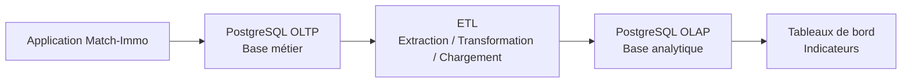
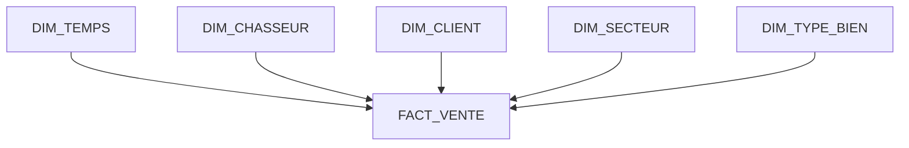

# OLTP / OLAP — Concepts et conception

## Phase 3 — Absorber la croissance

## 1. Objectif du document

Ce document explique comment Match-Immo sépare deux besoins différents :

- faire fonctionner l'activité quotidienne ;
- analyser l'activité dans le temps afin d'aider au pilotage et à la prise de décision.

Ces deux usages n'ont pas les mêmes contraintes.

Le système métier doit pouvoir répondre rapidement à des opérations comme :

```text
Créer un client
Créer une demande
Affecter un chasseur
Créer un mandat
Présenter un bien
Enregistrer une visite
Enregistrer une offre
Enregistrer la signature d'un acte authentique
Enregistrer les honoraires et commissions associés
```

À l'inverse, l'analyse décisionnelle doit pouvoir répondre à des questions comme :

```text
Combien de mandats ont été signés ce trimestre ?

Quel est le taux de transformation par chasseur ?

Combien de biens sont présentés avant une visite ?

Combien de visites sont nécessaires avant une vente ?

Quels secteurs produisent le plus de ventes ?

Quel est le montant total des ventes ?

Quel est le montant des commissions ?

Quel est le délai moyen entre un mandat et une vente ?
```

Pour éviter que ces analyses ne ralentissent le fonctionnement quotidien, l'architecture distingue :

```text
OLTP
=
fonctionnement métier quotidien

OLAP
=
analyse, statistiques et aide à la décision
```

---

# 2. Qu'est-ce que l'OLTP ?

**OLTP** signifie :

> Online Transaction Processing.

Il s'agit du système utilisé pour enregistrer les opérations quotidiennes de l'entreprise.

Dans Match-Immo, la base PostgreSQL métier constitue la base OLTP.

Elle contient notamment les données liées aux :

- utilisateurs ;
- clients ;
- chasseurs ;
- demandes ;
- versions de demandes ;
- mandats ;
- secteurs ;
- biens ;
- présentations de biens ;
- visites ;
- commentaires ;
- offres ;
- actes authentiques ;
- honoraires ;
- commissions ;
- paiements.

L'OLTP constitue donc la **source métier de référence**.

---

# 3. Exemple concret d'utilisation OLTP

Un prospect contacte Match-Immo pour rechercher un appartement.

Le fonctionnement métier peut être simplifié ainsi :

```text
Prospect
↓
Demande
↓
Version de la demande
↓
Affectation d'un chasseur
↓
Mandat
↓
Client
↓
Présentation de biens
↓
Visites
↓
Offre
↓
Acte authentique
↓
Honoraires / Commission
```

Dans le modèle Match-Immo, une **présentation** correspond au fait qu'un bien est proposé ou présenté dans le cadre d'un mandat.

L'**acte authentique** représente la finalisation juridique de la vente immobilière.

Chaque étape génère de petites opérations dans la base de données.

Exemple simplifié :

```sql
INSERT INTO visite (...)
```

Cette commande ajoute une nouvelle visite.

Autre exemple simplifié :

```sql
UPDATE offre
SET statut = 'acceptee'
WHERE id_offre = 125;
```

Cette commande modifie le statut d'une offre existante.

Ces opérations doivent être :

- rapides ;
- cohérentes ;
- fiables ;
- sécurisées.

C'est précisément le rôle de l'OLTP.

---

# 4. Qu'est-ce que l'OLAP ?

**OLAP** signifie :

> Online Analytical Processing.

Une base OLAP est organisée pour faciliter l'analyse d'un grand nombre de données.

Elle ne sert pas principalement à enregistrer une visite, modifier une offre ou créer un mandat.

Elle sert à répondre à des questions de pilotage.

Exemple :

```text
Combien de ventes ont été réalisées
par secteur,
par chasseur,
par mois,
sur les trois dernières années ?
```

Cette analyse peut nécessiter de parcourir beaucoup plus de données qu'une opération métier quotidienne.

---

# 5. Pourquoi séparer OLTP et OLAP ?

Supposons que la base métier contienne plusieurs millions de lignes.

Un chasseur souhaite consulter immédiatement une demande.

Au même moment, la direction souhaite analyser :

- plusieurs années d'activité ;
- tous les chasseurs ;
- tous les mandats ;
- toutes les présentations ;
- toutes les visites ;
- toutes les offres ;
- toutes les ventes ;
- tous les secteurs.

Une telle analyse peut nécessiter de parcourir et agréger un grand nombre de lignes.

Une **agrégation** est un calcul regroupant plusieurs données, par exemple :

```text
compter les ventes
calculer une moyenne
additionner les commissions
regrouper les résultats par mois
```

Si ces analyses lourdes sont exécutées directement sur la base métier, elles peuvent consommer des ressources nécessaires aux utilisateurs de l'application.

La séparation permet donc :

```text
Base OLTP
→ priorité au fonctionnement quotidien

Base OLAP
→ priorité aux analyses et statistiques
```

---

# 6. Architecture générale retenue



Le fonctionnement général est donc :

```text
Application
↓
Base métier OLTP
↓
ETL
↓
Base analytique OLAP
↓
Indicateurs
↓
Aide à la décision
```

---

# 7. Qu'est-ce qu'un ETL ?

**ETL** signifie :

> Extract, Transform, Load.

En français :

```text
Extract
=
Extraire

Transform
=
Transformer

Load
=
Charger
```

L'ETL permet de transférer les données nécessaires de l'OLTP vers l'OLAP.

Il ne s'agit pas simplement de recopier toutes les tables.

L'ETL sélectionne les informations nécessaires, les transforme lorsque cela est utile, puis les charge dans une structure adaptée à l'analyse.

---

# 8. Exemple réel d'ETL dans Match-Immo

Dans le modèle OLTP Match-Immo, il n'existe pas une table métier générique appelée `VENTE`.

La vente finalisée est représentée par :

```text
ACTE_AUTHENTIQUE
```

Cette table contient notamment l'identifiant de l'acte et le prix de vente.

Pour reconstruire le contexte complet d'une vente, plusieurs tables métier sont reliées.

La chaîne simplifiée est :

```text
ACTE_AUTHENTIQUE
        ↓
      OFFRE
        ↓
   PRESENTATION
     ↙       ↘
 MANDAT      BIEN
  ↓  ↓        ↓
CLIENT       SECTEUR
CHASSEUR
```

Pour la partie financière liée à la commission :

```text
ACTE_AUTHENTIQUE
        ↓
    HONORAIRES
        ↓
    COMMISSION
```

L'ETL peut alors fonctionner en trois étapes.

### Étape 1 — Extraire

Lire les données utiles dans les tables OLTP :

```text
ACTE_AUTHENTIQUE
OFFRE
PRESENTATION
MANDAT
BIEN
CLIENT
CHASSEUR
SECTEUR
HONORAIRES
COMMISSION
```

### Étape 2 — Transformer

Les données métier sont rapprochées afin de produire une information analytique cohérente.

Par exemple :

```text
ACTE_AUTHENTIQUE.date_acte
→ jour
→ mois
→ trimestre
→ année
```

Pour les indicateurs financiers :

```text
ACTE_AUTHENTIQUE.prix_vente
+
COMMISSION.montant_commission
→ indicateurs financiers
```

L'ETL peut également compter l'activité associée à un mandat :

```text
PRESENTATION
→ nombre de biens présentés

VISITE
→ nombre de visites

OFFRE
→ nombre d'offres

ACTE_AUTHENTIQUE
→ vente réalisée ou non
```

### Étape 3 — Charger

Les résultats sont ensuite chargés dans les tables analytiques :

```text
FACT_VENTE

FACT_ACTIVITE_MANDAT
```

---

# 9. Pourquoi ne pas simplement copier toute la base ?

L'objectif n'est pas de dupliquer intégralement la base métier.

Une base analytique doit contenir les données réellement utiles aux indicateurs.

Pour analyser une vente, il peut être utile de connaître :

- la date ;
- le secteur ;
- le chasseur ;
- le client concerné ;
- le type de bien ;
- le prix de vente ;
- la commission.

Il n'est pas nécessaire de recopier automatiquement toutes les informations personnelles détaillées du client.

Cette approche limite :

- les données inutiles ;
- les risques RGPD ;
- le volume de stockage ;
- la complexité du modèle analytique.

---

# 10. Le modèle décisionnel

Un **modèle décisionnel** est une organisation des données spécialement conçue pour les statistiques, les indicateurs et les tableaux de bord.

Le modèle retenu pour Match-Immo est un **schéma en étoile**.

Un schéma en étoile est composé de :

```text
une ou plusieurs tables de faits
+
plusieurs tables de dimensions
```

Les faits représentent ce que l'on mesure.

Les dimensions permettent d'expliquer ces mesures.

---

# 11. Qu'est-ce qu'une table de faits ?

Une **table de faits** contient les événements ou les mesures que l'on souhaite analyser.

Exemples :

```text
une vente
l'activité d'un mandat
un nombre de visites
un nombre d'offres
un montant financier
```

Elle contient généralement :

- des références vers les dimensions ;
- des valeurs mesurables ;
- des compteurs ;
- des références vers les données sources.

---

# 12. Qu'est-ce qu'une dimension ?

Une **dimension** donne du contexte à un fait.

Par exemple, une vente peut être analysée selon plusieurs axes :

```text
quand ?
→ DIM_TEMPS

quel chasseur ?
→ DIM_CHASSEUR

quel client ?
→ DIM_CLIENT

où ?
→ DIM_SECTEUR

quel type de bien ?
→ DIM_TYPE_BIEN
```

---

# 13. Schéma décisionnel retenu

Le premier modèle décisionnel Match-Immo repose sur deux tables de faits :

```text
FACT_VENTE

FACT_ACTIVITE_MANDAT
```

et cinq dimensions :

```text
DIM_TEMPS
DIM_CHASSEUR
DIM_CLIENT
DIM_SECTEUR
DIM_TYPE_BIEN
```

Le modèle reste volontairement limité aux informations nécessaires aux premiers indicateurs.

---

# 14. Vue en étoile de FACT_VENTE



Cette représentation peut également être lue ainsi :

```text
              DIM_TEMPS
                  |
                  |
DIM_CLIENT -- FACT_VENTE -- DIM_CHASSEUR
                  |
                  |
             DIM_SECTEUR
                  |
                  |
           DIM_TYPE_BIEN
```

---

# 15. Dimension temps

`DIM_TEMPS` facilite les analyses chronologiques.

Elle peut contenir :

```text
temps_key
date_complete
jour
mois
trimestre
annee
```

Exemple :

| date_complete | jour | mois | trimestre | annee |
|---|---:|---:|---:|---:|
| 2026-09-06 | 6 | 9 | 3 | 2026 |

Cela permet de calculer facilement :

```text
ventes par mois

ventes par trimestre

ventes par année

activité des mandats dans le temps
```

---

# 16. Dimension chasseur

`DIM_CHASSEUR` représente les chasseurs immobiliers.

Elle permet notamment d'analyser :

```text
nombre de mandats par chasseur

nombre de présentations

nombre de visites

nombre d'offres

nombre de ventes

activité par période
```

Elle peut contenir :

```text
chasseur_key
chasseur_id_source
nom
prenom
```

`chasseur_key` est l'identifiant utilisé dans l'OLAP.

`chasseur_id_source` conserve l'identifiant du chasseur provenant de l'OLTP.

Cela permet de conserver une traçabilité entre la donnée analytique et sa source métier.

---

# 17. Dimension client

`DIM_CLIENT` représente les clients nécessaires aux analyses.

Dans une logique de minimisation des données, elle peut rester volontairement limitée.

Exemple :

```text
client_key
client_id_source
```

Des informations personnelles supplémentaires ne doivent être ajoutées que si un besoin analytique réel les justifie.

Cela respecte le principe de **minimisation des données** du RGPD.

La minimisation signifie :

> ne conserver que les données nécessaires à l'objectif poursuivi.

---

# 18. Dimension secteur

`DIM_SECTEUR` permet les analyses géographiques.

Elle peut permettre de calculer :

```text
nombre de mandats par secteur

nombre de biens présentés par secteur

nombre de ventes par secteur

montant des ventes par secteur

activité dans le temps
```

Elle peut contenir :

```text
secteur_key
secteur_id_source
nom
```

Le secteur d'une vente pourra être retrouvé à partir du bien concerné par la présentation ayant conduit à l'offre puis à l'acte authentique.

---

# 19. Dimension type de bien

`DIM_TYPE_BIEN` permet de distinguer les différentes catégories de biens provenant de :

```text
BIEN.type_bien
```

Elle facilite des analyses comme :

```text
nombre de ventes par type de bien

prix moyen par type de bien

activité commerciale par type de bien
```

Elle peut contenir :

```text
type_bien_key
type_bien_source
```

---

# 20. Table de faits FACT_VENTE

`FACT_VENTE` représente les ventes finalisées.

Dans l'OLTP, la source métier de cette vente est :

```text
ACTE_AUTHENTIQUE
```

Il est parfaitement cohérent de conserver le nom analytique `FACT_VENTE`, car l'OLAP représente ici le concept métier que l'on souhaite analyser.

Une ligne de `FACT_VENTE` correspond à un acte authentique représentant une vente finalisée.

La table peut contenir :

```text
vente_key

temps_key
chasseur_key
client_key
secteur_key
type_bien_key

acte_id_source
prix_vente
montant_commission
```

`acte_id_source` correspond à :

```text
ACTE_AUTHENTIQUE.id_acte
```

Cette colonne assure la traçabilité avec l'enregistrement métier ayant produit le fait analytique.

`prix_vente` provient de :

```text
ACTE_AUTHENTIQUE.prix_vente
```

Le montant de commission est obtenu à partir de la chaîne :

```text
ACTE_AUTHENTIQUE
↓
HONORAIRES
↓
COMMISSION
```

---

# 21. Indicateurs issus de FACT_VENTE

Cette table permettra notamment de calculer :

```text
nombre de ventes

montant total des ventes

prix moyen de vente

commission totale

ventes par chasseur

ventes par secteur

ventes par mois

ventes par type de bien
```

Exemple de question métier :

> Quel chasseur a réalisé le plus de ventes au troisième trimestre 2026 ?

Le modèle OLAP permet de rapprocher :

```text
FACT_VENTE
+
DIM_CHASSEUR
+
DIM_TEMPS
```

pour répondre à cette question.

---

# 22. Table de faits FACT_ACTIVITE_MANDAT

`FACT_ACTIVITE_MANDAT` représente l'activité produite autour d'un mandat.

Son objectif est de permettre le suivi du parcours métier avant la vente.

Elle peut contenir :

```text
activite_mandat_key
mandat_id_source

temps_key
chasseur_key
client_key
secteur_key

nombre_propositions
nombre_visites
nombre_offres
vente_realisee
```

Dans ce modèle analytique, `nombre_propositions` désigne le nombre de biens présentés au client.

Sa source OLTP réelle est donc :

```text
PRESENTATION
```

On conserve ici le terme « proposition » comme indicateur métier compréhensible, tout en documentant précisément sa source technique.

---

# 23. Construction de FACT_ACTIVITE_MANDAT

La table est construite à partir du parcours réel du modèle OLTP :

```text
MANDAT
   ↓
PRESENTATION
   ↓
VISITE
   ↓
OFFRE
   ↓
ACTE_AUTHENTIQUE
```

Les indicateurs sont calculés ainsi :

```text
nombre_propositions
=
nombre de lignes PRESENTATION liées au mandat
```

```text
nombre_visites
=
nombre de VISITE associées aux présentations du mandat
```

```text
nombre_offres
=
nombre de OFFRE associées aux présentations du mandat
```

```text
vente_realisee
=
présence d'un ACTE_AUTHENTIQUE
pour une offre issue du mandat
```

Cette construction permet de mesurer l'ensemble du parcours commercial.

---

# 24. Pourquoi une table d'activité mandat ?

Une vente montre le résultat final.

Elle ne permet pas, à elle seule, de comprendre tout le travail réalisé avant cette vente.

Exemple :

```text
Mandat
↓
25 biens présentés
↓
6 visites
↓
2 offres
↓
1 acte authentique
↓
1 vente finalisée
```

Cette information permet de calculer :

```text
nombre moyen de biens présentés avant une visite

nombre moyen de visites avant une offre

nombre moyen d'offres avant une vente

taux de transformation d'un mandat
```

Cela permet de mesurer non seulement le résultat final, mais également le parcours ayant conduit à ce résultat.

---

