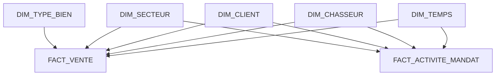

# OLTP / OLAP — Architecture, exploitation et traçabilité

# 25. Schéma analytique complet simplifié



Les deux tables de faits répondent donc à deux questions différentes :

```text
FACT_VENTE
→ quel résultat commercial a été obtenu ?

FACT_ACTIVITE_MANDAT
→ quel parcours a conduit à ce résultat ?
```

---

# 26. Exemple d'utilisation métier

La direction souhaite connaître :

> Le nombre moyen de visites nécessaires avant une vente, par chasseur.

Le système peut utiliser :

```text
FACT_ACTIVITE_MANDAT
+
DIM_CHASSEUR
```

pour produire un résultat de type :

| Chasseur | Mandats vendus | Visites | Moyenne visites / vente |
|---|---:|---:|---:|
| Chasseur A | 25 | 105 | 4,2 |
| Chasseur B | 18 | 99 | 5,5 |
| Chasseur C | 31 | 112 | 3,6 |

Ces valeurs sont uniquement un exemple pédagogique de restitution et ne représentent pas les données réelles de Match-Immo.

L'analyse peut aider à identifier :

- des différences d'activité ;
- des secteurs plus difficiles ;
- des parcours commerciaux plus longs ;
- des besoins d'accompagnement ;
- des tendances dans le temps.

---

# 27. Flux des données OLTP vers OLAP

Le principe d'alimentation est :

```text
POSTGRESQL OLTP
      |
      | lecture
      v
     ETL
      |
      | transformation
      v
POSTGRESQL OLAP
      |
      v
TABLEAUX DE BORD
```

L'ETL ne modifie pas les données métier originales.

Il :

```text
lit les données OLTP
↓
sélectionne les informations nécessaires
↓
les rapproche
↓
calcule certains indicateurs
↓
charge les résultats dans l'OLAP
```

---

# 28. Correspondance réelle OLTP → OLAP

La correspondance retenue est la suivante :

| Donnée métier OLTP | Destination ou utilisation OLAP |
|---|---|
| `ACTE_AUTHENTIQUE` | `FACT_VENTE` |
| `COMMISSION` | `montant_commission` dans `FACT_VENTE` |
| `MANDAT` | `FACT_ACTIVITE_MANDAT` |
| `PRESENTATION` | calcul de `nombre_propositions` |
| `VISITE` | calcul de `nombre_visites` |
| `OFFRE` | calcul de `nombre_offres` |
| `ACTE_AUTHENTIQUE` | calcul de `vente_realisee` |
| `CHASSEUR` | `DIM_CHASSEUR` |
| `CLIENT` | `DIM_CLIENT` |
| `SECTEUR` | `DIM_SECTEUR` |
| `BIEN.type_bien` | `DIM_TYPE_BIEN` |
| dates métier | `DIM_TEMPS` |

Cette correspondance permet de conserver une chaîne de traçabilité claire :

```text
donnée opérationnelle réelle
↓
transformation ETL
↓
donnée analytique
↓
indicateur métier
```

---

# 29. Exemple de reconstruction d'une vente

Pour produire une ligne de `FACT_VENTE`, l'ETL doit reconstruire le contexte de la vente.

Le parcours simplifié est :

```text
ACTE_AUTHENTIQUE
        |
        v
      OFFRE
        |
        v
   PRESENTATION
      /     \
     v       v
  MANDAT    BIEN
   /  \       |
  v    v      v
CLIENT CHASSEUR SECTEUR
```

Pour la commission :

```text
ACTE_AUTHENTIQUE
        |
        v
    HONORAIRES
        |
        v
    COMMISSION
```

Cela permet de produire une ligne analytique contenant par exemple :

```text
date de vente
chasseur
client
secteur
type de bien
prix de vente
commission
```

---

# 30. Pourquoi utiliser PostgreSQL également pour l'OLAP ?

À ce stade du projet, il n'est pas nécessaire d'introduire une nouvelle technologie de base de données.

PostgreSQL sait gérer :

- agrégations ;
- jointures ;
- vues ;
- index ;
- fonctions analytiques SQL ;
- volumes importants dans un dimensionnement adapté.

Une **jointure** permet de rapprocher des lignes provenant de plusieurs tables reliées entre elles.

Utiliser PostgreSQL pour l'OLTP et l'OLAP permet :

- de réduire le nombre de technologies ;
- de simplifier l'exploitation ;
- de limiter les coûts ;
- de conserver des compétences communes ;
- de rester cohérent avec l'architecture cible.

Les responsabilités OLTP et OLAP restent néanmoins séparées.

---

# 31. OLTP et OLAP ne sont pas le même environnement logique

Même si PostgreSQL est utilisé des deux côtés, leurs rôles sont différents.

```text
PostgreSQL OLTP
=
base métier

PostgreSQL OLAP
=
base décisionnelle
```

Dans le projet, cette séparation peut être matérialisée par un schéma PostgreSQL analytique dédié.

Par exemple :

```text
match_immo_olap
```

Les tables décisionnelles sont ainsi séparées des tables métier.

Dans une architecture de production plus importante, une séparation sur des instances différentes pourra également être étudiée si les mesures le justifient.

---

# 32. Fréquence d'alimentation

Les données OLAP n'ont pas obligatoirement besoin d'être synchronisées à chaque seconde.

Exemple :

```text
Nouvelle visite
→ nécessaire immédiatement dans l'OLTP

Indicateur mensuel
→ pas nécessairement recalculé à chaque seconde
```

Une alimentation périodique permet de limiter la charge.

La fréquence exacte devra découler du besoin métier.

À ce stade, le projet ne fixe donc pas arbitrairement une fréquence qui n'a pas encore été justifiée.

---

# 33. Historisation

Une base décisionnelle doit permettre de comprendre l'évolution de l'activité dans le temps.

Exemple :

```text
activité d'un chasseur en 2026

comparaison avec 2027

évolution des ventes par secteur

évolution du nombre de visites
```

`DIM_TEMPS` joue donc un rôle central.

Si certaines dimensions doivent elles-mêmes conserver leurs anciennes valeurs dans le futur, une technique d'historisation plus avancée pourra être étudiée.

Cette complexité n'est pas ajoutée tant qu'un besoin concret ne la justifie pas.

---

# 34. RGPD et modèle analytique

La base OLAP ne doit pas devenir une seconde base métier contenant inutilement toutes les données personnelles.

La stratégie retenue est :

```text
besoin analytique
↓
identifier les données nécessaires
↓
ne charger que ces données
```

Par exemple, pour calculer :

```text
nombre de ventes par secteur
```

il n'est pas nécessaire de connaître :

```text
adresse personnelle complète du client
numéro de téléphone
adresse email
```

Le modèle analytique proposé conserve donc une dimension client minimale.

Cette démarche respecte le principe de minimisation des données.

---

# 35. Sécurité

La séparation OLTP / OLAP permet également de gérer des droits différents.

Exemple :

```text
Application métier
→ accès aux données OLTP nécessaires

traitement ETL
→ lecture contrôlée de l'OLTP
→ écriture contrôlée dans l'OLAP

utilisateurs décisionnels
→ accès aux données OLAP nécessaires
```

Les utilisateurs n'ont donc pas besoin d'accéder directement à l'ensemble des tables techniques.

Cette séparation limite les accès inutiles.

---

# 36. Éco-conception

Créer et maintenir un environnement analytique supplémentaire consomme des ressources :

- processeur ;
- mémoire ;
- stockage ;
- énergie.

Il doit donc répondre à un besoin réel.

La stratégie Match-Immo consiste à éviter :

- la copie de données inutiles ;
- les calculs permanents sans besoin ;
- les rafraîchissements excessivement fréquents ;
- les infrastructures disproportionnées.

La logique reste :

```text
besoin
↓
données nécessaires
↓
traitement nécessaire
↓
ressources adaptées
```

---

# 37. Indicateurs envisageables

Le modèle proposé permet notamment de préparer les indicateurs suivants :

| Indicateur | Source analytique principale | Origine OLTP |
|---|---|---|
| Nombre de mandats | `FACT_ACTIVITE_MANDAT` | `MANDAT` |
| Nombre de biens présentés | `FACT_ACTIVITE_MANDAT` | `PRESENTATION` |
| Nombre de visites | `FACT_ACTIVITE_MANDAT` | `VISITE` |
| Nombre d'offres | `FACT_ACTIVITE_MANDAT` | `OFFRE` |
| Nombre de ventes | `FACT_VENTE` | `ACTE_AUTHENTIQUE` |
| Montant des ventes | `FACT_VENTE` | `ACTE_AUTHENTIQUE.prix_vente` |
| Commission totale | `FACT_VENTE` | `COMMISSION.montant_commission` |
| Activité par chasseur | faits + `DIM_CHASSEUR` | `CHASSEUR` |
| Activité par secteur | faits + `DIM_SECTEUR` | `SECTEUR` |
| Activité par type de bien | `FACT_VENTE` + `DIM_TYPE_BIEN` | `BIEN.type_bien` |
| Évolution temporelle | faits + `DIM_TEMPS` | dates métier |

Cette liste pourra évoluer en fonction des futurs besoins de pilotage.

---

# 38. Preuves techniques prévues

Ce document décrit le modèle décisionnel et explique les choix.

Deux fichiers SQL complètent cette documentation.

```text
sql/olap-schema.sql
```

Ce fichier doit créer réellement :

- le schéma OLAP ;
- les dimensions ;
- les tables de faits ;
- les clés ;
- les contraintes ;
- les index nécessaires.

Puis :

```text
sql/olap-etl.sql
```

Ce fichier doit réaliser l'alimentation à partir du véritable modèle métier OLTP.

Il devra donc utiliser les tables réelles :

```text
ACTE_AUTHENTIQUE
OFFRE
PRESENTATION
MANDAT
BIEN
VISITE
HONORAIRES
COMMISSION
CLIENT
CHASSEUR
SECTEUR
```

---

# 39. Pourquoi séparer documentation et SQL ?

Le fichier Markdown répond principalement aux questions :

```text
Pourquoi ?
Quel besoin ?
Comment fonctionne le modèle ?
Quelle décision a été prise ?
```

Les fichiers SQL répondent à une autre question :

```text
Est-ce réellement implémentable et reproductible ?
```

Cette séparation permet d'avoir :

- une documentation compréhensible par un acteur non technique ;
- une implémentation lisible par un développeur ;
- une preuve technique contrôlable par le jury ;
- une meilleure traçabilité entre conception et réalisation.

---

# 40. Schéma visuel attendu

Le diagramme Mermaid présent dans ce document permet de comprendre le principe.

Un schéma visuel indépendant sera également produit afin de disposer d'une preuve directement réutilisable dans le dépôt et lors de la soutenance.

Les fichiers prévus sont :

```text
olap-schema.mmd
olap-schema.svg
```

Le fichier `.mmd` contient la définition Mermaid.

Le fichier `.svg` constitue le rendu graphique.

Le schéma devra représenter clairement :

```text
DIM_TEMPS
DIM_CHASSEUR
DIM_CLIENT
DIM_SECTEUR
DIM_TYPE_BIEN

FACT_VENTE
FACT_ACTIVITE_MANDAT
```

---

# 41. Décision retenue

La décision d'architecture est :

```text
PostgreSQL OLTP
=
source métier principale

ETL
=
extraction et transformation contrôlées

PostgreSQL OLAP
=
environnement analytique

Modèle en étoile
=
organisation destinée aux indicateurs
```

Le modèle décisionnel initial repose sur :

```text
DIM_TEMPS
DIM_CHASSEUR
DIM_CLIENT
DIM_SECTEUR
DIM_TYPE_BIEN

FACT_VENTE
FACT_ACTIVITE_MANDAT
```

Les sources OLTP sont explicitement identifiées.

En particulier :

```text
ACTE_AUTHENTIQUE
→ vente finalisée

PRESENTATION
→ bien présenté dans le cadre d'un mandat

VISITE
→ visite réalisée

OFFRE
→ offre effectuée

COMMISSION
→ montant de commission
```

Cette structure couvre les premiers besoins de pilotage sans reproduire inutilement l'intégralité de la base métier.

---

# 42. Résultat attendu

À la fin de cette étape, Match-Immo disposera de :

```text
une base métier OLTP existante
+
un modèle analytique OLAP
+
un schéma en étoile
+
un schéma visuel
+
une alimentation ETL reproductible
```

La chaîne complète sera :

```text
Données métier OLTP
↓
Extraction
↓
Transformation
↓
Chargement OLAP
↓
Indicateurs
↓
Tableaux de bord
↓
Aide à la décision
```

---

# 43. Traçabilité de la conception

La conception OLAP ne repose pas sur des tables inventées pour faciliter la démonstration.

Elle est construite à partir du modèle métier cible Match-Immo.

Exemple :

```text
OLTP réel                     OLAP

ACTE_AUTHENTIQUE  ─────────→  FACT_VENTE

MANDAT             ─────────→  FACT_ACTIVITE_MANDAT

PRESENTATION       ─────────→  nombre_propositions

VISITE             ─────────→  nombre_visites

OFFRE              ─────────→  nombre_offres

COMMISSION         ─────────→  montant_commission

CHASSEUR           ─────────→  DIM_CHASSEUR

CLIENT             ─────────→  DIM_CLIENT

SECTEUR            ─────────→  DIM_SECTEUR

BIEN.type_bien     ─────────→  DIM_TYPE_BIEN
```

Cette correspondance permet à un lecteur de comprendre :

1. d'où vient la donnée ;
2. comment elle est transformée ;
3. où elle est stockée dans l'OLAP ;
4. à quel indicateur elle peut servir.

---

# 44. Conclusion

L'OLTP et l'OLAP répondent à deux besoins différents mais complémentaires.

L'OLTP permet à Match-Immo de fonctionner quotidiennement.

L'OLAP permet de comprendre, mesurer et piloter cette activité.

Le modèle décisionnel n'est pas construit indépendamment du modèle métier.

Il repose directement sur le parcours réel :

```text
MANDAT
↓
PRESENTATION
↓
VISITE
↓
OFFRE
↓
ACTE_AUTHENTIQUE
↓
HONORAIRES / COMMISSION
```

La chaîne analytique retenue est donc :

```text
Activité métier
↓
PostgreSQL OLTP
↓
ETL
↓
PostgreSQL OLAP
↓
Indicateurs
↓
Aide à la décision
```

Cette séparation permet :

- de protéger les performances de la base métier ;
- de simplifier les analyses ;
- de préparer les tableaux de bord ;
- de conserver une traçabilité avec les données sources ;
- de limiter les données personnelles copiées ;
- de conserver PostgreSQL comme socle cohérent ;
- de préparer la croissance future du projet.

Le modèle reste volontairement simple et évolutif.

Les prochaines preuves techniques sont :

```text
sql/olap-schema.sql
sql/olap-etl.sql
olap-schema.mmd
olap-schema.svg
```

Elles permettront de démontrer que le modèle décrit dans ce document est réellement implémentable, alimentable et représentable.
---

