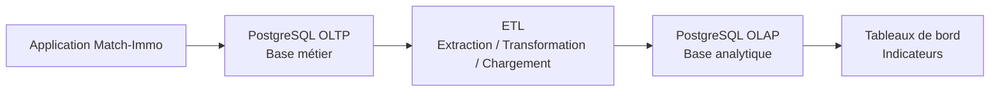
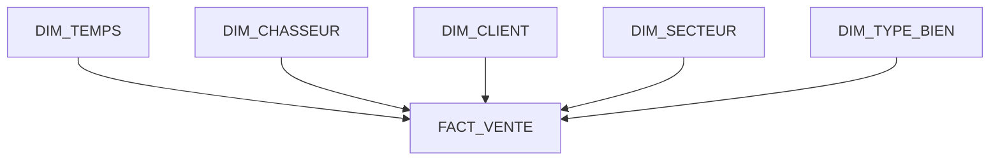
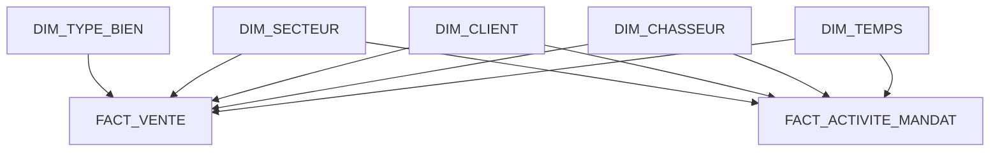

# OLTP / OLAP et modèle décisionnel — Match-Immo

## Phase 3 — Absorber la croissance

## 1. Objectif du document

Ce document explique comment Match-Immo sépare deux besoins différents :

- faire fonctionner l'activité quotidienne ;
- analyser l'activité dans le temps afin d'aider au pilotage et à la prise de décision.

Ces deux usages n'ont pas les mêmes contraintes.

Le système métier doit pouvoir répondre rapidement à des opérations comme :

```text
Créer un client
Créer une demande
Affecter un chasseur
Créer un mandat
Présenter un bien
Enregistrer une visite
Enregistrer une offre
Enregistrer la signature d'un acte authentique
Enregistrer les honoraires et commissions associés
```

À l'inverse, l'analyse décisionnelle doit pouvoir répondre à des questions comme :

```text
Combien de mandats ont été signés ce trimestre ?

Quel est le taux de transformation par chasseur ?

Combien de biens sont présentés avant une visite ?

Combien de visites sont nécessaires avant une vente ?

Quels secteurs produisent le plus de ventes ?

Quel est le montant total des ventes ?

Quel est le montant des commissions ?

Quel est le délai moyen entre un mandat et une vente ?
```

Pour éviter que ces analyses ne ralentissent le fonctionnement quotidien, l'architecture distingue :

```text
OLTP
=
fonctionnement métier quotidien

OLAP
=
analyse, statistiques et aide à la décision
```

---

# 2. Qu'est-ce que l'OLTP ?

**OLTP** signifie :

> Online Transaction Processing.

Il s'agit du système utilisé pour enregistrer les opérations quotidiennes de l'entreprise.

Dans Match-Immo, la base PostgreSQL métier constitue la base OLTP.

Elle contient notamment les données liées aux :

- utilisateurs ;
- clients ;
- chasseurs ;
- demandes ;
- versions de demandes ;
- mandats ;
- secteurs ;
- biens ;
- présentations de biens ;
- visites ;
- commentaires ;
- offres ;
- actes authentiques ;
- honoraires ;
- commissions ;
- paiements.

L'OLTP constitue donc la **source métier de référence**.

---

# 3. Exemple concret d'utilisation OLTP

Un prospect contacte Match-Immo pour rechercher un appartement.

Le fonctionnement métier peut être simplifié ainsi :

```text
Prospect
↓
Demande
↓
Version de la demande
↓
Affectation d'un chasseur
↓
Mandat
↓
Client
↓
Présentation de biens
↓
Visites
↓
Offre
↓
Acte authentique
↓
Honoraires / Commission
```

Dans le modèle Match-Immo, une **présentation** correspond au fait qu'un bien est proposé ou présenté dans le cadre d'un mandat.

L'**acte authentique** représente la finalisation juridique de la vente immobilière.

Chaque étape génère de petites opérations dans la base de données.

Exemple simplifié :

```sql
INSERT INTO visite (...)
```

Cette commande ajoute une nouvelle visite.

Autre exemple simplifié :

```sql
UPDATE offre
SET statut = 'acceptee'
WHERE id_offre = 125;
```

Cette commande modifie le statut d'une offre existante.

Ces opérations doivent être :

- rapides ;
- cohérentes ;
- fiables ;
- sécurisées.

C'est précisément le rôle de l'OLTP.

---

# 4. Qu'est-ce que l'OLAP ?

**OLAP** signifie :

> Online Analytical Processing.

Une base OLAP est organisée pour faciliter l'analyse d'un grand nombre de données.

Elle ne sert pas principalement à enregistrer une visite, modifier une offre ou créer un mandat.

Elle sert à répondre à des questions de pilotage.

Exemple :

```text
Combien de ventes ont été réalisées
par secteur,
par chasseur,
par mois,
sur les trois dernières années ?
```

Cette analyse peut nécessiter de parcourir beaucoup plus de données qu'une opération métier quotidienne.

---

# 5. Pourquoi séparer OLTP et OLAP ?

Supposons que la base métier contienne plusieurs millions de lignes.

Un chasseur souhaite consulter immédiatement une demande.

Au même moment, la direction souhaite analyser :

- plusieurs années d'activité ;
- tous les chasseurs ;
- tous les mandats ;
- toutes les présentations ;
- toutes les visites ;
- toutes les offres ;
- toutes les ventes ;
- tous les secteurs.

Une telle analyse peut nécessiter de parcourir et agréger un grand nombre de lignes.

Une **agrégation** est un calcul regroupant plusieurs données, par exemple :

```text
compter les ventes
calculer une moyenne
additionner les commissions
regrouper les résultats par mois
```

Si ces analyses lourdes sont exécutées directement sur la base métier, elles peuvent consommer des ressources nécessaires aux utilisateurs de l'application.

La séparation permet donc :

```text
Base OLTP
→ priorité au fonctionnement quotidien

Base OLAP
→ priorité aux analyses et statistiques
```

---

# 6. Architecture générale retenue



Le fonctionnement général est donc :

```text
Application
↓
Base métier OLTP
↓
ETL
↓
Base analytique OLAP
↓
Indicateurs
↓
Aide à la décision
```

---

# 7. Qu'est-ce qu'un ETL ?

**ETL** signifie :

> Extract, Transform, Load.

En français :

```text
Extract
=
Extraire

Transform
=
Transformer

Load
=
Charger
```

L'ETL permet de transférer les données nécessaires de l'OLTP vers l'OLAP.

Il ne s'agit pas simplement de recopier toutes les tables.

L'ETL sélectionne les informations nécessaires, les transforme lorsque cela est utile, puis les charge dans une structure adaptée à l'analyse.

---

# 8. Exemple réel d'ETL dans Match-Immo

Dans le modèle OLTP Match-Immo, il n'existe pas une table métier générique appelée `VENTE`.

La vente finalisée est représentée par :

```text
ACTE_AUTHENTIQUE
```

Cette table contient notamment l'identifiant de l'acte et le prix de vente.

Pour reconstruire le contexte complet d'une vente, plusieurs tables métier sont reliées.

La chaîne simplifiée est :

```text
ACTE_AUTHENTIQUE
        ↓
      OFFRE
        ↓
   PRESENTATION
     ↙       ↘
 MANDAT      BIEN
  ↓  ↓        ↓
CLIENT       SECTEUR
CHASSEUR
```

Pour la partie financière liée à la commission :

```text
ACTE_AUTHENTIQUE
        ↓
    HONORAIRES
        ↓
    COMMISSION
```

L'ETL peut alors fonctionner en trois étapes.

### Étape 1 — Extraire

Lire les données utiles dans les tables OLTP :

```text
ACTE_AUTHENTIQUE
OFFRE
PRESENTATION
MANDAT
BIEN
CLIENT
CHASSEUR
SECTEUR
HONORAIRES
COMMISSION
```

### Étape 2 — Transformer

Les données métier sont rapprochées afin de produire une information analytique cohérente.

Par exemple :

```text
ACTE_AUTHENTIQUE.date_acte
→ jour
→ mois
→ trimestre
→ année
```

Pour les indicateurs financiers :

```text
ACTE_AUTHENTIQUE.prix_vente
+
COMMISSION.montant_commission
→ indicateurs financiers
```

L'ETL peut également compter l'activité associée à un mandat :

```text
PRESENTATION
→ nombre de biens présentés

VISITE
→ nombre de visites

OFFRE
→ nombre d'offres

ACTE_AUTHENTIQUE
→ vente réalisée ou non
```

### Étape 3 — Charger

Les résultats sont ensuite chargés dans les tables analytiques :

```text
FACT_VENTE

FACT_ACTIVITE_MANDAT
```

---

# 9. Pourquoi ne pas simplement copier toute la base ?

L'objectif n'est pas de dupliquer intégralement la base métier.

Une base analytique doit contenir les données réellement utiles aux indicateurs.

Pour analyser une vente, il peut être utile de connaître :

- la date ;
- le secteur ;
- le chasseur ;
- le client concerné ;
- le type de bien ;
- le prix de vente ;
- la commission.

Il n'est pas nécessaire de recopier automatiquement toutes les informations personnelles détaillées du client.

Cette approche limite :

- les données inutiles ;
- les risques RGPD ;
- le volume de stockage ;
- la complexité du modèle analytique.

---

# 10. Le modèle décisionnel

Un **modèle décisionnel** est une organisation des données spécialement conçue pour les statistiques, les indicateurs et les tableaux de bord.

Le modèle retenu pour Match-Immo est un **schéma en étoile**.

Un schéma en étoile est composé de :

```text
une ou plusieurs tables de faits
+
plusieurs tables de dimensions
```

Les faits représentent ce que l'on mesure.

Les dimensions permettent d'expliquer ces mesures.

---

# 11. Qu'est-ce qu'une table de faits ?

Une **table de faits** contient les événements ou les mesures que l'on souhaite analyser.

Exemples :

```text
une vente
l'activité d'un mandat
un nombre de visites
un nombre d'offres
un montant financier
```

Elle contient généralement :

- des références vers les dimensions ;
- des valeurs mesurables ;
- des compteurs ;
- des références vers les données sources.

---

# 12. Qu'est-ce qu'une dimension ?

Une **dimension** donne du contexte à un fait.

Par exemple, une vente peut être analysée selon plusieurs axes :

```text
quand ?
→ DIM_TEMPS

quel chasseur ?
→ DIM_CHASSEUR

quel client ?
→ DIM_CLIENT

où ?
→ DIM_SECTEUR

quel type de bien ?
→ DIM_TYPE_BIEN
```

---

# 13. Schéma décisionnel retenu

Le premier modèle décisionnel Match-Immo repose sur deux tables de faits :

```text
FACT_VENTE

FACT_ACTIVITE_MANDAT
```

et cinq dimensions :

```text
DIM_TEMPS
DIM_CHASSEUR
DIM_CLIENT
DIM_SECTEUR
DIM_TYPE_BIEN
```

Le modèle reste volontairement limité aux informations nécessaires aux premiers indicateurs.

---

# 14. Vue en étoile de FACT_VENTE



Cette représentation peut également être lue ainsi :

```text
              DIM_TEMPS
                  |
                  |
DIM_CLIENT -- FACT_VENTE -- DIM_CHASSEUR
                  |
                  |
             DIM_SECTEUR
                  |
                  |
           DIM_TYPE_BIEN
```

---

# 15. Dimension temps

`DIM_TEMPS` facilite les analyses chronologiques.

Elle peut contenir :

```text
temps_key
date_complete
jour
mois
trimestre
annee
```

Exemple :

| date_complete | jour | mois | trimestre | annee |
|---|---:|---:|---:|---:|
| 2026-09-06 | 6 | 9 | 3 | 2026 |

Cela permet de calculer facilement :

```text
ventes par mois

ventes par trimestre

ventes par année

activité des mandats dans le temps
```

---

# 16. Dimension chasseur

`DIM_CHASSEUR` représente les chasseurs immobiliers.

Elle permet notamment d'analyser :

```text
nombre de mandats par chasseur

nombre de présentations

nombre de visites

nombre d'offres

nombre de ventes

activité par période
```

Elle peut contenir :

```text
chasseur_key
chasseur_id_source
nom
prenom
```

`chasseur_key` est l'identifiant utilisé dans l'OLAP.

`chasseur_id_source` conserve l'identifiant du chasseur provenant de l'OLTP.

Cela permet de conserver une traçabilité entre la donnée analytique et sa source métier.

---

# 17. Dimension client

`DIM_CLIENT` représente les clients nécessaires aux analyses.

Dans une logique de minimisation des données, elle peut rester volontairement limitée.

Exemple :

```text
client_key
client_id_source
```

Des informations personnelles supplémentaires ne doivent être ajoutées que si un besoin analytique réel les justifie.

Cela respecte le principe de **minimisation des données** du RGPD.

La minimisation signifie :

> ne conserver que les données nécessaires à l'objectif poursuivi.

---

# 18. Dimension secteur

`DIM_SECTEUR` permet les analyses géographiques.

Elle peut permettre de calculer :

```text
nombre de mandats par secteur

nombre de biens présentés par secteur

nombre de ventes par secteur

montant des ventes par secteur

activité dans le temps
```

Elle peut contenir :

```text
secteur_key
secteur_id_source
nom
```

Le secteur d'une vente pourra être retrouvé à partir du bien concerné par la présentation ayant conduit à l'offre puis à l'acte authentique.

---

# 19. Dimension type de bien

`DIM_TYPE_BIEN` permet de distinguer les différentes catégories de biens provenant de :

```text
BIEN.type_bien
```

Elle facilite des analyses comme :

```text
nombre de ventes par type de bien

prix moyen par type de bien

activité commerciale par type de bien
```

Elle peut contenir :

```text
type_bien_key
type_bien_source
```

---

# 20. Table de faits FACT_VENTE

`FACT_VENTE` représente les ventes finalisées.

Dans l'OLTP, la source métier de cette vente est :

```text
ACTE_AUTHENTIQUE
```

Il est parfaitement cohérent de conserver le nom analytique `FACT_VENTE`, car l'OLAP représente ici le concept métier que l'on souhaite analyser.

Une ligne de `FACT_VENTE` correspond à un acte authentique représentant une vente finalisée.

La table peut contenir :

```text
vente_key

temps_key
chasseur_key
client_key
secteur_key
type_bien_key

acte_id_source
prix_vente
montant_commission
```

`acte_id_source` correspond à :

```text
ACTE_AUTHENTIQUE.id_acte
```

Cette colonne assure la traçabilité avec l'enregistrement métier ayant produit le fait analytique.

`prix_vente` provient de :

```text
ACTE_AUTHENTIQUE.prix_vente
```

Le montant de commission est obtenu à partir de la chaîne :

```text
ACTE_AUTHENTIQUE
↓
HONORAIRES
↓
COMMISSION
```

---

# 21. Indicateurs issus de FACT_VENTE

Cette table permettra notamment de calculer :

```text
nombre de ventes

montant total des ventes

prix moyen de vente

commission totale

ventes par chasseur

ventes par secteur

ventes par mois

ventes par type de bien
```

Exemple de question métier :

> Quel chasseur a réalisé le plus de ventes au troisième trimestre 2026 ?

Le modèle OLAP permet de rapprocher :

```text
FACT_VENTE
+
DIM_CHASSEUR
+
DIM_TEMPS
```

pour répondre à cette question.

---

# 22. Table de faits FACT_ACTIVITE_MANDAT

`FACT_ACTIVITE_MANDAT` représente l'activité produite autour d'un mandat.

Son objectif est de permettre le suivi du parcours métier avant la vente.

Elle peut contenir :

```text
activite_mandat_key
mandat_id_source

temps_key
chasseur_key
client_key
secteur_key

nombre_propositions
nombre_visites
nombre_offres
vente_realisee
```

Dans ce modèle analytique, `nombre_propositions` désigne le nombre de biens présentés au client.

Sa source OLTP réelle est donc :

```text
PRESENTATION
```

On conserve ici le terme « proposition » comme indicateur métier compréhensible, tout en documentant précisément sa source technique.

---

# 23. Construction de FACT_ACTIVITE_MANDAT

La table est construite à partir du parcours réel du modèle OLTP :

```text
MANDAT
   ↓
PRESENTATION
   ↓
VISITE
   ↓
OFFRE
   ↓
ACTE_AUTHENTIQUE
```

Les indicateurs sont calculés ainsi :

```text
nombre_propositions
=
nombre de lignes PRESENTATION liées au mandat
```

```text
nombre_visites
=
nombre de VISITE associées aux présentations du mandat
```

```text
nombre_offres
=
nombre de OFFRE associées aux présentations du mandat
```

```text
vente_realisee
=
présence d'un ACTE_AUTHENTIQUE
pour une offre issue du mandat
```

Cette construction permet de mesurer l'ensemble du parcours commercial.

---

# 24. Pourquoi une table d'activité mandat ?

Une vente montre le résultat final.

Elle ne permet pas, à elle seule, de comprendre tout le travail réalisé avant cette vente.

Exemple :

```text
Mandat
↓
25 biens présentés
↓
6 visites
↓
2 offres
↓
1 acte authentique
↓
1 vente finalisée
```

Cette information permet de calculer :

```text
nombre moyen de biens présentés avant une visite

nombre moyen de visites avant une offre

nombre moyen d'offres avant une vente

taux de transformation d'un mandat
```

Cela permet de mesurer non seulement le résultat final, mais également le parcours ayant conduit à ce résultat.

---

# 25. Schéma analytique complet simplifié



Les deux tables de faits répondent donc à deux questions différentes :

```text
FACT_VENTE
→ quel résultat commercial a été obtenu ?

FACT_ACTIVITE_MANDAT
→ quel parcours a conduit à ce résultat ?
```

---

# 26. Exemple d'utilisation métier

La direction souhaite connaître :

> Le nombre moyen de visites nécessaires avant une vente, par chasseur.

Le système peut utiliser :

```text
FACT_ACTIVITE_MANDAT
+
DIM_CHASSEUR
```

pour produire un résultat de type :

| Chasseur | Mandats vendus | Visites | Moyenne visites / vente |
|---|---:|---:|---:|
| Chasseur A | 25 | 105 | 4,2 |
| Chasseur B | 18 | 99 | 5,5 |
| Chasseur C | 31 | 112 | 3,6 |

Ces valeurs sont uniquement un exemple pédagogique de restitution et ne représentent pas les données réelles de Match-Immo.

L'analyse peut aider à identifier :

- des différences d'activité ;
- des secteurs plus difficiles ;
- des parcours commerciaux plus longs ;
- des besoins d'accompagnement ;
- des tendances dans le temps.

---

# 27. Flux des données OLTP vers OLAP

Le principe d'alimentation est :

```text
POSTGRESQL OLTP
      |
      | lecture
      v
     ETL
      |
      | transformation
      v
POSTGRESQL OLAP
      |
      v
TABLEAUX DE BORD
```

L'ETL ne modifie pas les données métier originales.

Il :

```text
lit les données OLTP
↓
sélectionne les informations nécessaires
↓
les rapproche
↓
calcule certains indicateurs
↓
charge les résultats dans l'OLAP
```

---

# 28. Correspondance réelle OLTP → OLAP

La correspondance retenue est la suivante :

| Donnée métier OLTP | Destination ou utilisation OLAP |
|---|---|
| `ACTE_AUTHENTIQUE` | `FACT_VENTE` |
| `COMMISSION` | `montant_commission` dans `FACT_VENTE` |
| `MANDAT` | `FACT_ACTIVITE_MANDAT` |
| `PRESENTATION` | calcul de `nombre_propositions` |
| `VISITE` | calcul de `nombre_visites` |
| `OFFRE` | calcul de `nombre_offres` |
| `ACTE_AUTHENTIQUE` | calcul de `vente_realisee` |
| `CHASSEUR` | `DIM_CHASSEUR` |
| `CLIENT` | `DIM_CLIENT` |
| `SECTEUR` | `DIM_SECTEUR` |
| `BIEN.type_bien` | `DIM_TYPE_BIEN` |
| dates métier | `DIM_TEMPS` |

Cette correspondance permet de conserver une chaîne de traçabilité claire :

```text
donnée opérationnelle réelle
↓
transformation ETL
↓
donnée analytique
↓
indicateur métier
```

---

# 29. Exemple de reconstruction d'une vente

Pour produire une ligne de `FACT_VENTE`, l'ETL doit reconstruire le contexte de la vente.

Le parcours simplifié est :

```text
ACTE_AUTHENTIQUE
        |
        v
      OFFRE
        |
        v
   PRESENTATION
      /     \
     v       v
  MANDAT    BIEN
   /  \       |
  v    v      v
CLIENT CHASSEUR SECTEUR
```

Pour la commission :

```text
ACTE_AUTHENTIQUE
        |
        v
    HONORAIRES
        |
        v
    COMMISSION
```

Cela permet de produire une ligne analytique contenant par exemple :

```text
date de vente
chasseur
client
secteur
type de bien
prix de vente
commission
```

---

# 30. Pourquoi utiliser PostgreSQL également pour l'OLAP ?

À ce stade du projet, il n'est pas nécessaire d'introduire une nouvelle technologie de base de données.

PostgreSQL sait gérer :

- agrégations ;
- jointures ;
- vues ;
- index ;
- fonctions analytiques SQL ;
- volumes importants dans un dimensionnement adapté.

Une **jointure** permet de rapprocher des lignes provenant de plusieurs tables reliées entre elles.

Utiliser PostgreSQL pour l'OLTP et l'OLAP permet :

- de réduire le nombre de technologies ;
- de simplifier l'exploitation ;
- de limiter les coûts ;
- de conserver des compétences communes ;
- de rester cohérent avec l'architecture cible.

Les responsabilités OLTP et OLAP restent néanmoins séparées.

---

# 31. OLTP et OLAP ne sont pas le même environnement logique

Même si PostgreSQL est utilisé des deux côtés, leurs rôles sont différents.

```text
PostgreSQL OLTP
=
base métier

PostgreSQL OLAP
=
base décisionnelle
```

Dans le projet, cette séparation peut être matérialisée par un schéma PostgreSQL analytique dédié.

Par exemple :

```text
match_immo_olap
```

Les tables décisionnelles sont ainsi séparées des tables métier.

Dans une architecture de production plus importante, une séparation sur des instances différentes pourra également être étudiée si les mesures le justifient.

---

# 32. Fréquence d'alimentation

Les données OLAP n'ont pas obligatoirement besoin d'être synchronisées à chaque seconde.

Exemple :

```text
Nouvelle visite
→ nécessaire immédiatement dans l'OLTP

Indicateur mensuel
→ pas nécessairement recalculé à chaque seconde
```

Une alimentation périodique permet de limiter la charge.

La fréquence exacte devra découler du besoin métier.

À ce stade, le projet ne fixe donc pas arbitrairement une fréquence qui n'a pas encore été justifiée.

---

# 33. Historisation

Une base décisionnelle doit permettre de comprendre l'évolution de l'activité dans le temps.

Exemple :

```text
activité d'un chasseur en 2026

comparaison avec 2027

évolution des ventes par secteur

évolution du nombre de visites
```

`DIM_TEMPS` joue donc un rôle central.

Si certaines dimensions doivent elles-mêmes conserver leurs anciennes valeurs dans le futur, une technique d'historisation plus avancée pourra être étudiée.

Cette complexité n'est pas ajoutée tant qu'un besoin concret ne la justifie pas.

---

# 34. RGPD et modèle analytique

La base OLAP ne doit pas devenir une seconde base métier contenant inutilement toutes les données personnelles.

La stratégie retenue est :

```text
besoin analytique
↓
identifier les données nécessaires
↓
ne charger que ces données
```

Par exemple, pour calculer :

```text
nombre de ventes par secteur
```

il n'est pas nécessaire de connaître :

```text
adresse personnelle complète du client
numéro de téléphone
adresse email
```

Le modèle analytique proposé conserve donc une dimension client minimale.

Cette démarche respecte le principe de minimisation des données.

---

# 35. Sécurité

La séparation OLTP / OLAP permet également de gérer des droits différents.

Exemple :

```text
Application métier
→ accès aux données OLTP nécessaires

traitement ETL
→ lecture contrôlée de l'OLTP
→ écriture contrôlée dans l'OLAP

utilisateurs décisionnels
→ accès aux données OLAP nécessaires
```

Les utilisateurs n'ont donc pas besoin d'accéder directement à l'ensemble des tables techniques.

Cette séparation limite les accès inutiles.

---

# 36. Éco-conception

Créer et maintenir un environnement analytique supplémentaire consomme des ressources :

- processeur ;
- mémoire ;
- stockage ;
- énergie.

Il doit donc répondre à un besoin réel.

La stratégie Match-Immo consiste à éviter :

- la copie de données inutiles ;
- les calculs permanents sans besoin ;
- les rafraîchissements excessivement fréquents ;
- les infrastructures disproportionnées.

La logique reste :

```text
besoin
↓
données nécessaires
↓
traitement nécessaire
↓
ressources adaptées
```

---

# 37. Indicateurs envisageables

Le modèle proposé permet notamment de préparer les indicateurs suivants :

| Indicateur | Source analytique principale | Origine OLTP |
|---|---|---|
| Nombre de mandats | `FACT_ACTIVITE_MANDAT` | `MANDAT` |
| Nombre de biens présentés | `FACT_ACTIVITE_MANDAT` | `PRESENTATION` |
| Nombre de visites | `FACT_ACTIVITE_MANDAT` | `VISITE` |
| Nombre d'offres | `FACT_ACTIVITE_MANDAT` | `OFFRE` |
| Nombre de ventes | `FACT_VENTE` | `ACTE_AUTHENTIQUE` |
| Montant des ventes | `FACT_VENTE` | `ACTE_AUTHENTIQUE.prix_vente` |
| Commission totale | `FACT_VENTE` | `COMMISSION.montant_commission` |
| Activité par chasseur | faits + `DIM_CHASSEUR` | `CHASSEUR` |
| Activité par secteur | faits + `DIM_SECTEUR` | `SECTEUR` |
| Activité par type de bien | `FACT_VENTE` + `DIM_TYPE_BIEN` | `BIEN.type_bien` |
| Évolution temporelle | faits + `DIM_TEMPS` | dates métier |

Cette liste pourra évoluer en fonction des futurs besoins de pilotage.

---

# 38. Preuves techniques prévues

Ce document décrit le modèle décisionnel et explique les choix.

Deux fichiers SQL complètent cette documentation.

```text
sql/olap-schema.sql
```

Ce fichier doit créer réellement :

- le schéma OLAP ;
- les dimensions ;
- les tables de faits ;
- les clés ;
- les contraintes ;
- les index nécessaires.

Puis :

```text
sql/olap-etl.sql
```

Ce fichier doit réaliser l'alimentation à partir du véritable modèle métier OLTP.

Il devra donc utiliser les tables réelles :

```text
ACTE_AUTHENTIQUE
OFFRE
PRESENTATION
MANDAT
BIEN
VISITE
HONORAIRES
COMMISSION
CLIENT
CHASSEUR
SECTEUR
```

---

# 39. Pourquoi séparer documentation et SQL ?

Le fichier Markdown répond principalement aux questions :

```text
Pourquoi ?
Quel besoin ?
Comment fonctionne le modèle ?
Quelle décision a été prise ?
```

Les fichiers SQL répondent à une autre question :

```text
Est-ce réellement implémentable et reproductible ?
```

Cette séparation permet d'avoir :

- une documentation compréhensible par un acteur non technique ;
- une implémentation lisible par un développeur ;
- une preuve technique contrôlable par le jury ;
- une meilleure traçabilité entre conception et réalisation.

---

# 40. Schéma visuel attendu

Le diagramme Mermaid présent dans ce document permet de comprendre le principe.

Un schéma visuel indépendant sera également produit afin de disposer d'une preuve directement réutilisable dans le dépôt et lors de la soutenance.

Les fichiers prévus sont :

```text
olap-schema.mmd
olap-schema.svg
```

Le fichier `.mmd` contient la définition Mermaid.

Le fichier `.svg` constitue le rendu graphique.

Le schéma devra représenter clairement :

```text
DIM_TEMPS
DIM_CHASSEUR
DIM_CLIENT
DIM_SECTEUR
DIM_TYPE_BIEN

FACT_VENTE
FACT_ACTIVITE_MANDAT
```

---

# 41. Décision retenue

La décision d'architecture est :

```text
PostgreSQL OLTP
=
source métier principale

ETL
=
extraction et transformation contrôlées

PostgreSQL OLAP
=
environnement analytique

Modèle en étoile
=
organisation destinée aux indicateurs
```

Le modèle décisionnel initial repose sur :

```text
DIM_TEMPS
DIM_CHASSEUR
DIM_CLIENT
DIM_SECTEUR
DIM_TYPE_BIEN

FACT_VENTE
FACT_ACTIVITE_MANDAT
```

Les sources OLTP sont explicitement identifiées.

En particulier :

```text
ACTE_AUTHENTIQUE
→ vente finalisée

PRESENTATION
→ bien présenté dans le cadre d'un mandat

VISITE
→ visite réalisée

OFFRE
→ offre effectuée

COMMISSION
→ montant de commission
```

Cette structure couvre les premiers besoins de pilotage sans reproduire inutilement l'intégralité de la base métier.

---

# 42. Résultat attendu

À la fin de cette étape, Match-Immo disposera de :

```text
une base métier OLTP existante
+
un modèle analytique OLAP
+
un schéma en étoile
+
un schéma visuel
+
une alimentation ETL reproductible
```

La chaîne complète sera :

```text
Données métier OLTP
↓
Extraction
↓
Transformation
↓
Chargement OLAP
↓
Indicateurs
↓
Tableaux de bord
↓
Aide à la décision
```

---

# 43. Traçabilité de la conception

La conception OLAP ne repose pas sur des tables inventées pour faciliter la démonstration.

Elle est construite à partir du modèle métier cible Match-Immo.

Exemple :

```text
OLTP réel                     OLAP

ACTE_AUTHENTIQUE  ─────────→  FACT_VENTE

MANDAT             ─────────→  FACT_ACTIVITE_MANDAT

PRESENTATION       ─────────→  nombre_propositions

VISITE             ─────────→  nombre_visites

OFFRE              ─────────→  nombre_offres

COMMISSION         ─────────→  montant_commission

CHASSEUR           ─────────→  DIM_CHASSEUR

CLIENT             ─────────→  DIM_CLIENT

SECTEUR            ─────────→  DIM_SECTEUR

BIEN.type_bien     ─────────→  DIM_TYPE_BIEN
```

Cette correspondance permet à un lecteur de comprendre :

1. d'où vient la donnée ;
2. comment elle est transformée ;
3. où elle est stockée dans l'OLAP ;
4. à quel indicateur elle peut servir.

---

# 44. Conclusion

L'OLTP et l'OLAP répondent à deux besoins différents mais complémentaires.

L'OLTP permet à Match-Immo de fonctionner quotidiennement.

L'OLAP permet de comprendre, mesurer et piloter cette activité.

Le modèle décisionnel n'est pas construit indépendamment du modèle métier.

Il repose directement sur le parcours réel :

```text
MANDAT
↓
PRESENTATION
↓
VISITE
↓
OFFRE
↓
ACTE_AUTHENTIQUE
↓
HONORAIRES / COMMISSION
```

La chaîne analytique retenue est donc :

```text
Activité métier
↓
PostgreSQL OLTP
↓
ETL
↓
PostgreSQL OLAP
↓
Indicateurs
↓
Aide à la décision
```

Cette séparation permet :

- de protéger les performances de la base métier ;
- de simplifier les analyses ;
- de préparer les tableaux de bord ;
- de conserver une traçabilité avec les données sources ;
- de limiter les données personnelles copiées ;
- de conserver PostgreSQL comme socle cohérent ;
- de préparer la croissance future du projet.

Le modèle reste volontairement simple et évolutif.

Les prochaines preuves techniques sont :

```text
sql/olap-schema.sql
sql/olap-etl.sql
olap-schema.mmd
olap-schema.svg
```

Elles permettront de démontrer que le modèle décrit dans ce document est réellement implémentable, alimentable et représentable.
---

# 45. Mise à jour du 09/09/2026 — Qualité des données analytiques

## 45.1 Pourquoi cette mise à jour ?

Lors de la première rédaction de ce document, les scripts techniques OLAP
étaient présentés comme les prochaines preuves à produire.

Au 09/09/2026, ces éléments existent désormais :

```text
03-architecture/sql/olap-schema.sql
03-architecture/sql/olap-etl.sql
03-architecture/olap-schema.mmd
03-architecture/olap-schema.svg
```

L'alimentation analytique est donc formalisée et les contrôles de qualité
peuvent être rattachés directement au fonctionnement réel de l'ETL.

Cette section ne remplace pas l'état précédent du document.

Elle constitue un repère temporel permettant de tracer l'avancement du projet.

---

## 45.2 Définition de la qualité analytique

La qualité analytique consiste à vérifier que les données utilisées pour les
indicateurs sont suffisamment :

- complètes ;
- cohérentes ;
- non dupliquées ;
- reliées aux bonnes données métier ;
- traçables jusqu'à leur source ;
- exploitables pour les calculs décisionnels.

Une donnée peut être techniquement chargée dans l'OLAP mais rester incorrecte
pour le métier.

Exemple :

```text
vente présente dans FACT_VENTE
+
mauvais chasseur associé
=
donnée techniquement présente
mais indicateur métier faux
```

La qualité doit donc être contrôlée à plusieurs niveaux.

---

## 45.3 Contrôles intégrés dans l'ETL

Le script :

```text
03-architecture/sql/olap-etl.sql
```

intègre déjà plusieurs mécanismes de qualité.

### Contrôle des valeurs nécessaires

Certaines données ne sont chargées que lorsqu'une valeur nécessaire existe.

Exemples présents dans le script :

```sql
WHERE dates.date_complete IS NOT NULL
```

et :

```sql
WHERE b.type_bien IS NOT NULL
```

L'objectif est d'éviter d'introduire dans certaines dimensions des valeurs
inexploitables pour l'analyse.

---

## 45.4 Gestion des doublons

Le script utilise notamment `UNION`.

Contrairement à `UNION ALL`, `UNION` élimine les lignes identiques produites
par les différentes branches d'une requête.

Le chargement utilise également une logique :

```sql
ON CONFLICT (...)
DO UPDATE
```

Lorsqu'une donnée métier déjà connue est rencontrée, ses valeurs analytiques
sont recalculées et mises à jour au lieu de créer systématiquement une nouvelle
ligne.

Cette logique contribue à rendre le chargement rejouable.

---

## 45.5 Contrôle transactionnel

L'ETL fonctionne dans une transaction PostgreSQL.

Le principe est :

```text
BEGIN
↓
transformations et chargements
↓
contrôles techniques
↓
COMMIT
```

Avec une exécution utilisant :

```text
psql -v ON_ERROR_STOP=1
```

une erreur SQL interrompt le traitement avant sa validation définitive.

Cela limite le risque de conserver un chargement partiellement exécuté.

---

## 45.6 Contrôles de volumes après ETL

Après le chargement, le script compte les lignes présentes dans :

```text
dim_temps
dim_chasseur
dim_client
dim_secteur
dim_type_bien
fact_vente
fact_activite_mandat
```

Ces comptages permettent notamment de détecter :

- une table restée vide de manière inattendue ;
- un chargement incomplet ;
- une différence importante de volumétrie entre deux exécutions.

Un comptage ne prouve cependant pas à lui seul la qualité métier.

Il constitue un premier niveau de contrôle.

---

## 45.7 Contrôle métier des ventes

Le script reconstruit une vue lisible des ventes chargées en reliant :

```text
FACT_VENTE
↓
DIM_TEMPS
DIM_CHASSEUR
DIM_SECTEUR
DIM_TYPE_BIEN
```

Il affiche notamment :

- l'identifiant de l'acte source ;
- la date de vente ;
- le chasseur ;
- le secteur ;
- le type de bien ;
- le prix de vente ;
- les honoraires ;
- la commission.

Ce contrôle permet de vérifier humainement qu'une vente analytique reste
compréhensible et cohérente avec son contexte métier.

---

## 45.8 Contrôle métier de l'activité des mandats

Le second contrôle métier porte sur :

```text
FACT_ACTIVITE_MANDAT
```

Il restitue notamment :

- le mandat source ;
- la date de signature ;
- le chasseur ;
- le nombre de présentations ;
- le nombre de visites ;
- le nombre d'offres ;
- l'existence ou non d'une vente.

Ce contrôle permet de vérifier les agrégations utilisées ensuite pour calculer
des indicateurs de performance.

---

## 45.9 Traçabilité avec l'OLTP

Les tables de faits conservent des références vers les objets métier sources,
notamment :

```text
acte_id_source
mandat_id_source
```

Cette traçabilité permet de revenir de l'indicateur analytique vers la donnée
opérationnelle ayant servi à le produire.

La chaîne de preuve devient donc :

```text
donnée OLTP
↓
transformation ETL
↓
donnée OLAP
↓
contrôle
↓
indicateur
```

---

## 45.10 Règles qualité retenues

| Risque qualité | Contrôle retenu | État au 09/09/2026 |
| --- | --- | --- |
| Valeur analytique nécessaire absente | Filtrage des valeurs `NULL` concernées | Implémenté |
| Doublon lors du chargement | `UNION` et gestion `ON CONFLICT` | Implémenté |
| ETL partiellement exécuté | Transaction PostgreSQL + arrêt sur erreur | Implémenté |
| Mauvaise volumétrie après chargement | Comptage des dimensions et faits | Implémenté |
| Vente mal reconstruite | Contrôle métier détaillé de `FACT_VENTE` | Implémenté |
| Activité mandat incohérente | Contrôle métier de `FACT_ACTIVITE_MANDAT` | Implémenté |
| Perte de traçabilité avec la source | Identifiants métier source conservés | Implémenté |
| Donnée personnelle inutile dans l'OLAP | Sélection limitée aux informations utiles aux indicateurs | Prévu dans le modèle |

---

## 45.11 Ce que les contrôles ne démontrent pas encore

Au 09/09/2026, ces contrôles constituent une base technique défendable, mais ils
ne représentent pas encore une chaîne complète de Data Quality industrialisée.

Ne sont notamment pas encore démontrés :

- un tableau de bord automatisé de qualité ;
- des seuils d'alerte de production ;
- une historisation des résultats de contrôle à chaque ETL ;
- une notification automatique lorsqu'un seuil est dépassé ;
- un catalogue de règles de qualité administré ;
- une supervision continue de l'alimentation analytique.

Ces mécanismes pourront être ajoutés lorsque l'exploitation réelle du système
le justifiera.

Le principe reste :

> **contrôler ce qui est utile avant d'ajouter une plateforme de qualité plus
> complexe.**

---

## 45.12 État de la preuve au 09/09/2026

La preuve demandée pour la partie analytique peut désormais être reliée à trois
éléments complémentaires :

```text
SCHÉMA OLAP
→ olap-schema.mmd
→ olap-schema.svg
→ sql/olap-schema.sql

ALIMENTATION
→ sql/olap-etl.sql

QUALITÉ ANALYTIQUE
→ contrôles intégrés dans l'ETL
→ présente section du dossier OLTP / OLAP
```

Ainsi, la qualité analytique n'est pas décrite dans un document isolé et
redondant.

Elle est documentée dans le dossier qui explique déjà le modèle décisionnel et
rattachée au script qui réalise effectivement l'alimentation.

---

## 45.13 Conclusion de la mise à jour

Au 09/09/2026, le bloc OLTP / OLAP dispose désormais :

- d'un modèle décisionnel documenté ;
- d'un schéma logique et SQL ;
- d'un ETL ;
- de mécanismes de prévention de doublons ;
- de contrôles de volumes ;
- de contrôles métier ;
- d'une traçabilité avec les données sources ;
- d'une formalisation explicite de la qualité analytique.

Les travaux futurs concernent principalement l'industrialisation et la
supervision continue, et non la preuve de conception initiale de la chaîne
analytique.

---

# 46. Mise à jour du 09/09/2026 — Preuve d'exécution de l'OLAP

## 46.1 Objet

Cette section complète la preuve de conception et de qualité analytique par une
mesure observée directement dans la base PostgreSQL du projet.

Elle ne remplace pas les sections précédentes.

Elle ajoute une preuve d'exécution datée au 09/09/2026.

---

## 46.2 Présence des tables analytiques

Le schéma PostgreSQL :

```text
match_immo_olap
```

contient les sept tables attendues :

```text
dim_chasseur
dim_client
dim_secteur
dim_temps
dim_type_bien
fact_activite_mandat
fact_vente
```

Le schéma analytique n'est donc pas uniquement défini dans un fichier SQL.

Il est effectivement présent dans la base utilisée pour les travaux du projet.

---

## 46.3 Volumes observés au 09/09/2026

Le contrôle exécuté dans PostgreSQL retourne :

| Table OLAP | Nombre de lignes observé |
| --- | ---: |
| `dim_chasseur` | 6 |
| `dim_client` | 18 |
| `dim_secteur` | 10 |
| `dim_temps` | 18 |
| `dim_type_bien` | 3 |
| `fact_activite_mandat` | 16 |
| `fact_vente` | 2 |

Ces valeurs constituent une observation réelle de l'état de l'OLAP au
09/09/2026.

---

## 46.4 Interprétation

Les dimensions principales sont alimentées :

```text
6 chasseurs
18 clients
10 secteurs
18 dates
3 types de bien
```

La table :

```text
fact_activite_mandat
```

contient :

```text
16 lignes
```

Ce volume est cohérent avec les 16 mandats historiquement migrés dans le modèle
cible.

La table :

```text
fact_vente
```

contient :

```text
2 lignes
```

Cela démontre que le processus analytique est capable de produire des faits de
vente à partir des données présentes dans l'OLTP.

---

## 46.5 Chaîne de preuve

La chaîne analytique peut désormais être représentée ainsi :

```text
modèle OLTP
↓
données métier présentes
↓
ETL
↓
schéma match_immo_olap
↓
dimensions alimentées
↓
tables de faits alimentées
↓
contrôles de volumes
```

La preuve ne repose donc plus uniquement sur :

```text
un schéma
+
un script
```

mais également sur :

```text
des données effectivement chargées
+
des volumes observés
```

---

## 46.6 Limites

Cette preuve confirme l'exécution et l'alimentation de l'OLAP sur le jeu de
données actuel du projet.

Elle ne démontre pas encore :

- une exécution automatisée planifiée ;
- une supervision continue ;
- des alertes de qualité ;
- une historisation automatique des résultats de contrôle ;
- un ETL de production à grande échelle.

Ces éléments relèvent de l'industrialisation future.

---

## 46.7 Conclusion

Au 09/09/2026, le bloc OLTP / OLAP dispose désormais de quatre niveaux de
preuve :

```text
1. conception
2. implémentation SQL
3. contrôles de qualité
4. alimentation réelle observée
```

Les volumes observés dans `match_immo_olap` constituent une preuve technique
supplémentaire que le modèle analytique est non seulement conçu mais également
alimenté dans l'environnement du projet.
