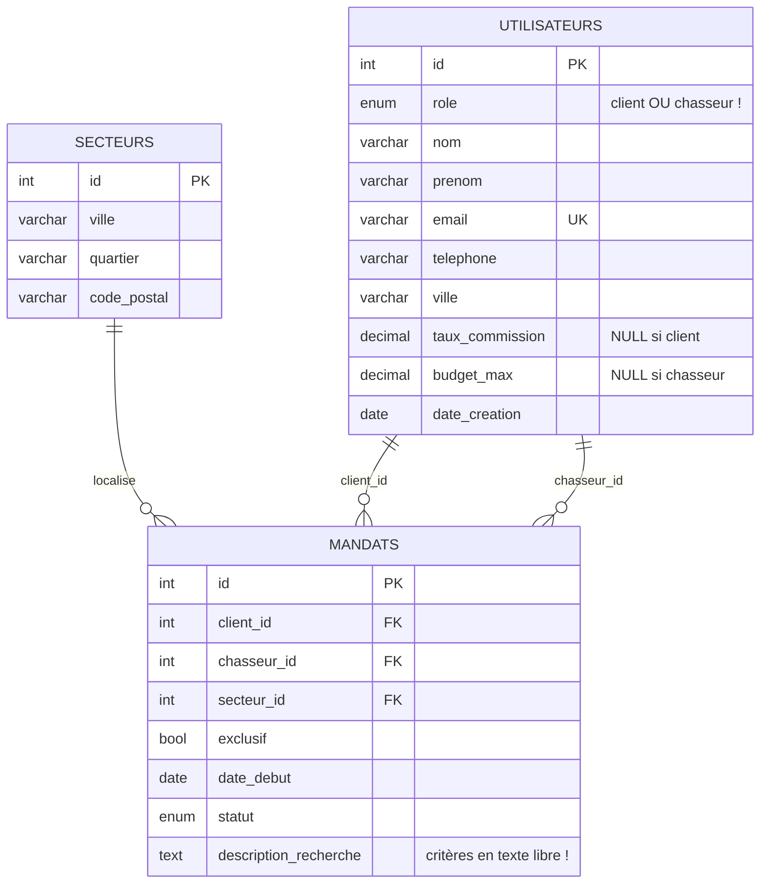

# Fixtures — Projet fil rouge « Chasse immobilière »

Vous trouverez ici deux fichiers, **même jeu de données**, un par SGBD :

| Fichier | Cible | Où atterrissent les données |
| --- | --- | --- |
| [`MySQL.sql`](MySQL.sql) | MariaDB / MySQL — port `3306` | **database** `Fil_Rouge_Depart` |
| [`PgSQL.sql`](PgSQL.sql) | PostgreSQL — port `5433`, base `DB_Cours` | **schéma** `Fil_Rouge_Depart` |

> ⚠️ **Ces fichiers ne doivent pas être modifiés.** Ils constituent l'existant "hérité" du SI de l'entreprise et votre référence de départ pour l'audit et vos préconisations.

---

## 📝 Les annotations du consultant

Le consultant passé avant vous a parsemé les deux fichiers de remarques, repérables par le préfixe `-- [consultant]`. Il a visiblement été **surpris par l'état du schéma et la faible exploitabilité des données** : rôles mélangés dans une seule table, colonnes vides par conception, critères de recherche noyés dans du texte libre, durée de mandat de 6 mois qui n'apparaît nulle part, et même une ligne dont il doute franchement.

> Ces annotations **ne sont pas des consignes**. Ce sont les observations, parfois agacées, d'un professionnel. **Votre travail d'audit consiste précisément à les prendre pour ce qu'elles sont** : des pistes à vérifier. À vous d'établir lesquelles sont fondées, de les qualifier (structure ? donnée ? règle métier ?), de les prioriser et de décider ce que le futur modèle doit corriger.

---

## ⚠️ Périmètre : ces 3 tables sont *tout* l'existant

Le schéma hérité ne contient que **`secteurs`, `utilisateurs`, `mandats`**. C'est **volontaire** et **normal** : l'écart entre ce maigre existant et le métier décrit dans le [Readme principal](../Readme.md) (biens, visites, offres, actes, honoraires, barèmes, performance…) **est précisément l'objet de votre travail**. Ne cherchez pas de tables manquantes : vous allez les concevoir.

---

## Date de référence

> 📅 **On se place au 25 juillet 2026.** Toutes les questions faisant intervenir « aujourd'hui » (mandats expirés, validité des 6 mois…) se raisonnent à cette date, afin que le corrigé reste stable dans le temps.

---

## Exécution

Les deux scripts sont **rejouables** : ils commencent par un `DROP` de la database (MariaDB) ou du schéma (PostgreSQL). Les rejouer **efface** ce que vous auriez ajouté — travaillez dans vos propres fichiers.

```bash
docker compose up -d
```

### MariaDB / MySQL

```bash
docker compose exec -T mariadb mariadb -uroot -prootPassword < fixtures/MySQL.sql
```

### PostgreSQL

```bash
docker compose exec -T postgres psql -U user -d DB_Cours < fixtures/PgSQL.sql
```

Ou, dans les deux cas : ouvrir le fichier dans **Tabularis**, **phpMyAdmin** ou **PgAdmin** et l'exécuter.

Sous PostgreSQL, pensez à vous placer dans le schéma pour vos sessions suivantes :

```sql
SET search_path TO "Fil_Rouge_Depart";

-- ou préfixez chaque table :
SELECT * FROM "Fil_Rouge_Depart".mandats;
```

> 💡 Le schéma s'appelle `"Fil_Rouge_Depart"` **avec majuscules** : sous PostgreSQL, il faut donc **toujours les guillemets doubles**. Sans eux, PostgreSQL replie le nom en minuscules et ne trouve pas le schéma.

---

## Contenu attendu après import

Les scripts se terminent par leurs propres requêtes de contrôle. Vous devez voir :

| Table | Lignes | Détail |
| --- | --- | --- |
| `secteurs` | 10 | Montpellier (4 quartiers), Castelnau-le-Lez, Lattes, Lyon (2), Nantes, Sète |
| `utilisateurs` | 24 | **6 chasseurs** (id 1→6) + **18 clients** (id 7→24) |
| `mandats` | 18 | **11 `actif`, 3 `termine`, 2 `expire`, 2 `suspendu`** |

```sql
SELECT role, COUNT(*) FROM utilisateurs GROUP BY role;
SELECT statut, COUNT(*) FROM mandats GROUP BY statut;
SELECT COUNT(*) FROM secteurs;
```

> Répartition des statuts, vérifiée ligne à ligne : `actif` = 11, `termine` = 3, `expire` = 2, `suspendu` = 2 (total 18).

---

## Schéma hérité



---
